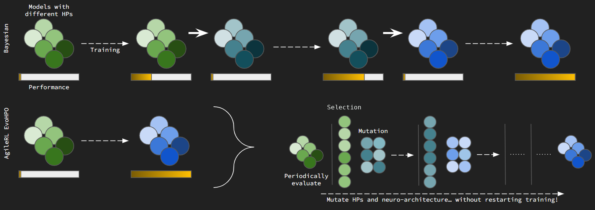
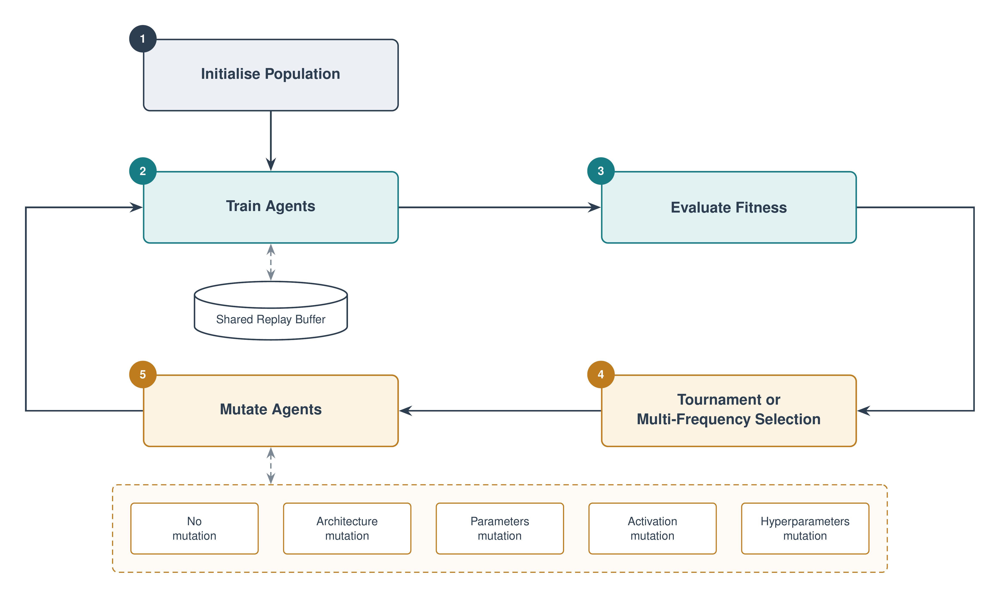

.. _evo_hyperparam_opt:

Evolutionary Hyperparameter Optimization
========================================

Traditionally, hyperparameter optimization (HPO) for reinforcement learning (RL) is particularly difficult when compared to other types of machine learning.
This is for several reasons, including the relative sample inefficiency of RL and its sensitivity to hyperparameters.

AgileRL is focused on improving HPO for RL in order to allow faster development with robust training.
Evolutionary algorithms have been shown to allow faster, automatic convergence to optimal hyperparameters than other HPO methods by taking advantage of
shared memory between a population of agents acting in identical environments.

   Our evolutionary approach allows for HPO in a single training run compared to Bayesian
   methods that require multiple sequential training runs to achieve similar, and often
   inferior, results.

At regular intervals, after learning from shared experiences, a population of agents can be evaluated in an environment.
Each evolution step then has two parts. First, a **selection strategy** reshapes the population, preserving the strongest
agents and nominating which agents to perturb. Then a shared **mutation** step perturbs those nominated agents to further
explore the hyperparameter and architecture space. AgileRL provides two interchangeable selection strategies: :ref:`tournament selection <tournament_selection>`
(the default) and :ref:`multi-frequency selection <multi_frequency_selection>`. Both hand their nominated agents to
the same :ref:`mutation <mutations>` operators. In short, a selection strategy decides *which* agents are perturbed, while
mutation decides *how*.

.. toctree::
   :hidden:
   :maxdepth: 1

   tournament_selection
   mutation
   multi_frequency

   The AgileRL evolutionary hyperparameter optimization loop.
