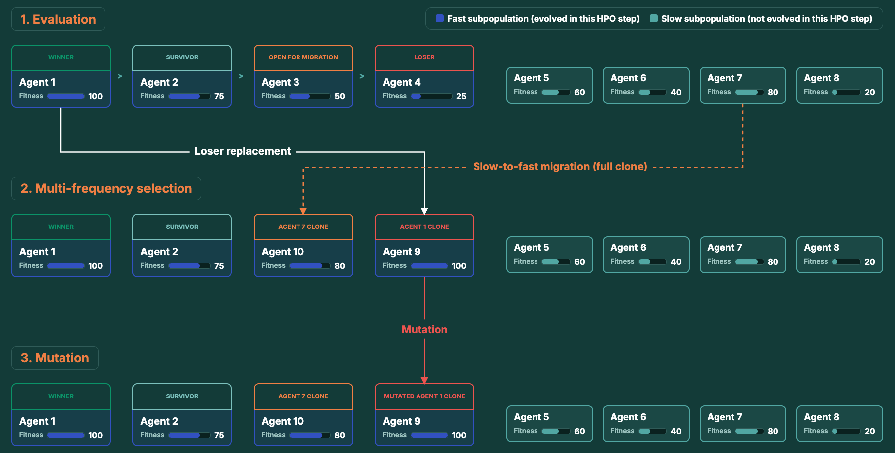

.. _multi_frequency_selection:

Multi-Frequency Selection
=========================

Multi-frequency selection is an alternative selection strategy that **replaces tournament
selection**; combined with the shared :ref:`mutation <mutations>` step it yields
**Multiple-Frequencies Population-Based Training** (MF-PBT,
`Doulazmi et al. <https://arxiv.org/abs/2506.03225>`_). Rather than updating the whole
population together, it splits the population into ``n_subpopulations`` subpopulations that
each evolve at their own frequency: subpopulation ``i`` only evolves every
``evolution_frequency_ratios[i]`` evaluation cycles. Keeping several evolution frequencies
alive at once counteracts the greediness of single-frequency PBT, where a short evolution
horizon collapses the population onto whichever schedule looks best in the near term.

Each evolution step ranks a subpopulation by fitness into four brackets: **winners**,
**survivors**, **open-for-migration** and **losers**. Every loser is replaced by a clone of
a winner, and the winners and survivors are kept unchanged. **Migration** then fills the
open-for-migration slots with stronger agents from other subpopulations: a migrant from a
faster subpopulation contributes only its trained weights while adopting the local elite's
hyperparameters, whereas a migrant from a slower-or-equal subpopulation is cloned in full.

The *perturbation* applied to those winner-clones is the shared :ref:`mutation <mutations>`
step: multi-frequency selection nominates exactly the clones that replace losers, and only
they are mutated. Winners, survivors and migrants pass through untouched.

   A single MF-PBT evolution step, illustrated for a fast subpopulation (Agents 1–4,
   *due* to evolve this cycle) alongside a slow subpopulation (Agents 5–8, left untouched
   this cycle). **1. Evaluation** collects the fitness of all the agents, which is used to
   rank the evolved subpopulation into four brackets: winner, survivor, open-for-migration
   and loser. **2. Multi-frequency selection** replaces the loser (Agent 4) with a clone
   of the winner (Agent 1), and fills the open-for-migration slot (Agent 3) by migration,
   here a full clone (weights *and* hyperparameters) of Agent 7, the strongest agent from
   the slower subpopulation. **3. Mutation** perturbs only the winner-clone that replaced
   the loser; the migrant, winner and survivor pass through untouched.

**When to use it.** MF-PBT shines with **16 or more agents** (as recommended by the
paper), where there is room for several subpopulations at different frequencies: its
slower subpopulations make it more robust to premature convergence than tournament
selection, while its faster subpopulations allow for more refined hyperparameter
schedules. The trade-offs are that it needs a larger population to be worthwhile and
exposes more configuration parameters. For small populations, prefer
:ref:`tournament_selection`.

Multi-frequency and tournament selection share the single ``selection_strategy`` manifest block
(also accepted under its former name, ``tournament_selection``), discriminated by a ``strategy``
field that defaults to ``tournament``. To use MF-PBT, set ``strategy: multi_frequency`` and supply
the subpopulation layout in the same block (the two regimes are mutually exclusive, so only one
is ever configured).
As with tournament selection, ``training.pop_size`` is the mandatory population size; MF-PBT
reads it and derives the per-subpopulation size as ``pop_size // n_subpopulations``. The bracket
sizes and frequency ratios have sensible defaults (leave them out to accept them):

.. code-block:: yaml

    # `strategy` defaults to `tournament`; set it to `multi_frequency` for MF-PBT.
    selection_strategy:
      strategy: multi_frequency
      n_subpopulations: 2                 # >= 2
      n_winners: 2                        # >= 1
      n_survivors: 0                      # >= 0
      n_open_for_migration: 2             # >= 1
      n_losers: 4                         # >= 1
      evolution_frequency_ratios: [1, 5]  # strictly increasing ints >= 1, one per subpop

    training:
      pop_size: 16                        # >= 6, a multiple of n_subpopulations

``n_subpopulations`` defaults to ``2``, so with the recommended ``pop_size`` of 16 the
population is 16 agents in two subpopulations of 8. The bracket sizes must sum to the
subpopulation size ``pop_size // n_subpopulations``; their defaults are
``round(0.25 * subpop)`` winners and open-for-migration agents, ``0`` survivors and the
remainder as losers, and the frequency-ratio default is ``[1, 5, 10, …]``. The recommended
configuration is the one shown above: **16 agents in 2 subpopulations of 8**, split into
**2 winners / 0 survivors / 2 open-for-migration / 4 losers** with frequency ratios
**[1, 5]**.

Constructing a trainer directly, the same block is passed as the single
``selection_strategy`` argument (``LocalTrainer(selection_strategy=MultiFrequencySelectionSpec(...))``)
which is the one argument that selects between the two regimes.

Multi-frequency selection is implemented by :class:`MultiFrequencySelection <agilerl.hpo.multi_frequency.MultiFrequencySelection>`
and dispatched from the trainers via
:func:`run_selection_and_mutation <agilerl.utils.utils.run_selection_and_mutation>`,
which routes to either tournament selection followed by mutations or multi-frequency
selection by the type of selection strategy. Both classic-RL and LLM finetuning
populations are supported.

.. tutorial::

   :ref:`mf_pbt_tutorial`
      Train a PPO population on LunarLander-v3 with MF-PBT, via a YAML manifest and the constructor.
