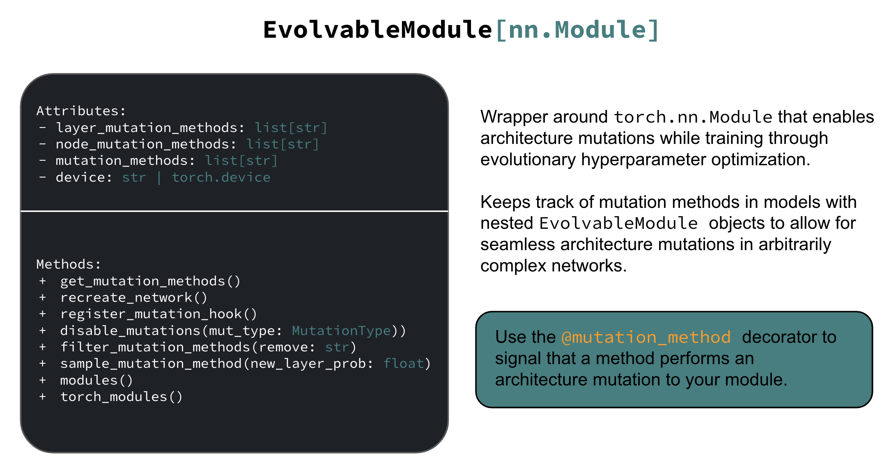
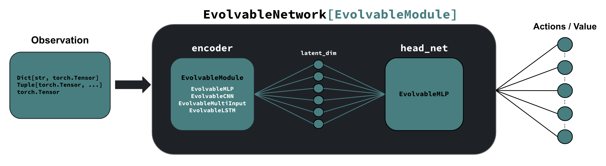

.. _evolvable_networks:

Evolvable Neural Networks in AgileRL
------------------------------------

Other than the hyperparemeters pertaining to the specific algorithm you're using to optimize your agent, a large source of variance in
the performance of your agent is the choice network architecture. Tuning the architecture of your network is usually a very time-consuming and tedious task,
requiring multiple training runs that can take days or even weeks to execute. AgileRL allows you to automatically tune the architecture of your network in
a single training run through :ref:`evolutionary hyperparameter optimization <evo_hyperparam_opt>`.

Basic Neural Networks
~~~~~~~~~~~~~~~~~~~~~

In order to mutate the architecture of neural networks seamlessly, we define the :class:`~agilerl.modules.base.EvolvableModule` base class as a building block
for all networks used in AgileRL. This is nothing but a wrapper around :class:`~torch.nn.Module` that allows us to keep track of the methods that mutate a network
in networks with nested evolvable modules.

   Structure of an ``EvolvableModule`` showing the relationship with ``torch.nn.Module`` and mutation capabilities

Examples of some very basic modules included in AgileRL are:

- :class:`~agilerl.modules.mlp.EvolvableMLP`: Multi-layer perceptron (MLP) network that maps vector observations to a desired number of outputs, including mutation methods that allow for the random addition or removal of layers and nodes.

- :class:`~agilerl.modules.cnn.EvolvableCNN`: Convolutional neural network (CNN) that maps image observations to a desired number of outputs, including mutation methods that allow for the random addition or removal of convolutional layers and neurons, as well as changing the kernel sizes.

- :class:`~agilerl.modules.multi_input.EvolvableMultiInput`: Network that maps dictionary or tuple observations to a desired number of outputs. This module includes nested ``EvolvableModule``'s to process each element of the dictionary or tuple observation separately into a latent space, which are then concatenated and processed by a final dense layer to form a number of outputs. Includes the mutation methods of all nested ``EvolvableModule``'s.

Policies, Value Functions, and More Complex Networks
~~~~~~~~~~~~~~~~~~~~~~~~~~~~~~~~~~~~~~~~~~~~~~~~~~~~

In Reinforcement Learning, we often require processing very different types of observations into either actions or values / state-action values.
In order to make the implementation of evolvable policies, value functions, and more complex networks as seamless as possible, we define the :class:`~agilerl.modules.base.EvolvableNetwork`
base class which inherits from :class:`~agilerl.modules.base.EvolvableModule`. The diagram below shows the expected structure of a neural network inheriting from this class.

   Structure of an ``EvolvableNetwork``, showing the underlying encoder and head networks which are ``EvolvableModule``'s themselves.

When inheriting from this class, we must pass in the observation space of the environment to the constructor of the class. This allows the network to automatically
build an appropriate encoder from the observation space. Off-the-shelf ``EvolvableNetwork``'s in AgileRL natively support the following observation spaces:

- :class:`~gymnasium.spaces.Box`: Use an ``EvolvableMLP``, ``EvolvableCNN``, or ``EvolvableLSTM`` as the encoder, depending on the dimensionality of the observation space.
- :class:`~gymnasium.spaces.Dict`: Use an ``EvolvableMultiInput`` as the encoder.
- :class:`~gymnasium.spaces.Tuple`: Use an ``EvolvableMultiInput`` as the encoder.
- :class:`~gymnasium.spaces.MultiBinary`: Use an ``EvolvableMLP`` as the encoder.
- :class:`~gymnasium.spaces.MultiDiscrete`: Use an ``EvolvableMLP`` as the encoder.

The encoder processes observations into a latent space, which is then processed by the head network (usually a ``EvolvableMLP``) to form the final output of the network. The
following networks, common in a variety of reinforcement learning algorithms, are supported out of the box:

- :class:`~agilerl.networks.q_networks.QNetwork`: Outputs a state-action value given an observation and action (used in e.g. DQN).
- :class:`~agilerl.networks.q_networks.RainbowQNetwork`: Uses a distributional dueling architecture to output a distribution of state-action values given an observation and action (used in e.g. Rainbow DQN).
- :class:`~agilerl.networks.q_networks.ContinuousQNetwork`: Outputs a continuous state-action value given an observation and action (used in e.g. DDPG, TD3).
- :class:`~agilerl.networks.value_networks.ValueNetwork`: Outputs a single value given an observation (used in e.g. PPO, bandit algorithms).
- :class:`~agilerl.networks.actors.DeterministicActor`: Outputs deterministic actions given an observation (used in e.g. DDPG, TD3).
- :class:`~agilerl.networks.actors.StochasticActor`: Outputs stochastic actions given an observation (used in e.g. PPO).

.. note::
    All ``EvolvableNetwork`` objects expect that the only modules that contribute towards its mutation method are the encoder and head networks. This is
    done to ensure that the same mutation can be applied across the different networks optimized in an algorithm during training e.g. actor and critic, since
    these usually solve problems that are very similar in nature and thus require similar architectures.

Configuring the Architecture of ``EvolvableNetwork``'s
~~~~~~~~~~~~~~~~~~~~~~~~~~~~~~~~~~~~~~~~~~~~~~~~~~~~~

In order to configure the architecture of ``EvolvableNetwork``'s, we must pass in separate dictionaries that specify the architecture of the encoder and head networks through
the ``encoder_config`` and ``head_config`` arguments of the constructor of the ``EvolvableNetwork`` class. These dictionaries should include the arguments of the corresponding
``EvolvableModule``'s constructor.

If your environment has a 1D ``Box`` observation space, by default the ``EvolvableNetwork`` will use a ``EvolvableMLP`` as the encoder.

.. code-block:: python

    from gymnasium.spaces import Box, Discrete

    from agilerl.networks.q_networks import QNetwork

    encoder_config = {
        "hidden_size": [64, 64] # Two layers of 64 nodes each
        "min_mlp_nodes": 16 # minimum number of nodes in the MLP when mutating
        "max_mlp_nodes": 128 # maximum number of nodes in the MLP when mutating
    }

    head_config = {
        "hidden_size": [64, 64] # Two layers of 64 nodes each
        "min_mlp_nodes": 16, # minimum number of nodes in the MLP when mutating
        "max_mlp_nodes": 128, # maximum number of nodes in the MLP when mutating
    }

    observation_space = Box(low=-100, high=100, shape=(10,))
    action_space = Discrete(2)

    network = QNetwork(
        observation_space,
        action_space,
        encoder_config=encoder_config,
        head_config=head_config,
        latent_dim=32, # Dimension of the latent space representation
        min_latent_dim=8, # Minimum dimension of the latent space representation
        max_latent_dim=128, # Maximum dimension of the latent space representation
    )

If your environment has a 3D ``Box`` observation space, by default the ``EvolvableNetwork`` will use a ``EvolvableCNN`` as the encoder.

.. code-block:: python

    from gymnasium.spaces import Box, Discrete

    from agilerl.networks.q_networks import StochasticActor

    encoder_config = {
        "channel_size": [32, 64, 128], # Three convolutional layers with 32, 64, and 128 channels respectively
        "kernel_size": [8, 4, 3], # The kernel sizes of the convolutional layers
        "stride_size": [4, 2, 1], # The stride sizes of the convolutional layers
        "min_channel_size": 16, # minimum number of channels in the CNN when mutating
        "max_channel_size": 256, # maximum number of channels in the CNN when mutating
    }

    head_config = {
        "hidden_size": [64, 64] # Two layers of 64 nodes each
        "min_mlp_nodes": 16, # minimum number of nodes in the MLP when mutating
        "max_mlp_nodes": 128, # maximum number of nodes in the MLP when mutating
    }

    observation_space = Box(low=-100, high=100, shape=(10, 10, 10))
    action_space = Discrete(2)

    network = StochasticActor(
        observation_space,
        action_space,
        encoder_config=encoder_config,
        head_config=head_config,
        latent_dim=32, # Dimension of the latent space representation
        min_latent_dim=8, # Minimum dimension of the latent space representation
        max_latent_dim=128, # Maximum dimension of the latent space representation
    )

.. note::
    In AgileRL algorithms, pass a single ``net_config`` dictionary that includes the ``encoder_config`` and ``head_config`` dictionaries, as well as any other arguments to
    the corresponding network used in the algorithm.

Using Non-Evolvable Networks in an Evolvable Setting
~~~~~~~~~~~~~~~~~~~~~~~~~~~~~~~~~~~~~~~~~~~~~~~~~~~~

It is common that users require using either pre-trained networks or custom architectures that don't inherit from ``EvolvableModule``, but still wish
to exploit parameter optimization to automatically tune the RL hyperparameters of an algorithm. In order to do this, users can use :class:`DummyEvolvable <agilerl.modules.dummy.DummyEvolvable>`
to wrap their non-evolvable networks in a manner compatible with our mutations framework - disabling architecture mutations but still allowing for RL hyperparameter and random weight mutations.

**Example Usage**

.. code-block:: python

    import torch
    import torch.nn as nn

    from sgilerl.algorithms import DQN
    from agilerl.modules.dummy import DummyEvolvable

    class BasicNetActorDQN(nn.Module):
      def __init__(self, input_size, hidden_sizes, output_size):
          super().__init__()
          layers = []

          # Add input layer
          layers.append(nn.Linear(input_size, hidden_sizes[0]))
          layers.append(nn.ReLU())  # Activation function

          # Add hidden layers
          for i in range(len(hidden_sizes) - 1):
              layers.append(nn.Linear(hidden_sizes[i], hidden_sizes[i + 1]))
              layers.append(nn.ReLU())  # Activation function

          # Add output layer with a sigmoid activation
          layers.append(nn.Linear(hidden_sizes[-1], output_size))

          # Combine all layers into a sequential model
          self.model = nn.Sequential(*layers)

      def forward(self, x):
          return self.model(x)

    device = torch.device("cuda" if torch.cuda.is_available() else "cpu")
    actor_kwargs = {
        "input_size": 4,  # Input size
        "hidden_sizes": [64, 64],  # Hidden layer sizes
        "output_size": 2  # Output size
    }

    actor = DummyEvolvable(BasicNetActor, actor_kwargs, device=device)

    # Use the actor in an algorithm
    observation_space = ...
    action_space = ...
    population = DQN.population(
        size=4,
        observation_space=observation_space,
        action_space=action_space
        actor_network=actor
        )

Integrating Architecture Mutations Into a Custom PyTorch Network
----------------------------------------------------------------

.. warning::
  The following section pertains to the :class:`MakeEvolvable <agilerl.wrappers.make_evolvable.MakeEvolvable>` wrapper, which will be deprecated in a
  future release. We recommend using the :class:`EvolvableModule <agilerl.modules.base.EvolvableModule>` and :class:`EvolvableNetwork <agilerl.networks.base.EvolvableNetwork>`
  classes to create custom networks, or wrapping your ``nn.Module`` objects with :class:`DummyEvolvable <agilerl.modules.dummy.DummyEvolvable>`.

For sequential architectures that users have already implemented using PyTorch, it is also possible to add
evolvable functionality through the ``MakeEvolvable`` wrapper. Below is an example of a simple multi-layer
perceptron that can be used by a DQN agent to solve the Lunar Lander environment. The input size is set as
the state dimensions and output size the action dimensions. It's worth noting that, during the model definition,
it is imperative to employ the ``torch.nn`` module to define all layers instead of relying on functions from
``torch.nn.functional`` within the forward() method of the network. This is crucial as the forward hooks implemented
will only be able to detect layers derived from ``nn.Module``.

.. code-block:: python

    import torch.nn as nn
    import torch

    class MLPActor(nn.Module):
        def __init__(self, input_size, output_size):
            super(MLPActor, self).__init__()

            self.linear_layer_1 = nn.Linear(input_size, 64)
            self.linear_layer_2 = nn.Linear(64, output_size)
            self.relu = nn.ReLU()

        def forward(self, x):
            x = self.relu(self.linear_layer_1(x))
            x = self.linear_layer_2(x)
            return x

To make this network evolvable, simply instantiate an MLP Actor object and then pass it, along with an input tensor into
the ``MakeEvolvable`` wrapper.

.. code-block:: python

    from agilerl.wrappers.make_evolvable import MakeEvolvable

    observation_space = env.single_observation_space
    action_space = env.single_action_space

    actor = MLPActor(observation_space.shape[0], action_space.n)
    evolvable_actor = MakeEvolvable(
                        actor,
                        input_tensor=torch.randn(observation_space.shape[0]),
                        device=device
                      )

When instantiating using ``create_population`` to generate a population of agents with a custom actor,
you need to set ``actor_network`` to ``evolvable_actor``.

.. code-block:: python

    pop = create_population(
            algo="DQN",                                  # Algorithm
            observation_space=observation_space,         # Observation space
            action_space=action_space,                   # Action space
            actor_network=evolvable_actor,               # Custom evolvable actor
            INIT_HP=INIT_HP,                             # Initial hyperparameters
            population_size=INIT_HP["POPULATION_SIZE"],  # Population size
            device=device
          )

If you are using an algorithm that also uses a single critic (PPO, DDPG), define the critic network and pass it into the
``create_population`` class.

.. code-block:: python

    pop = create_population(
            algo="PPO",                                  # Algorithm
            observation_space=observation_space,         # Observation space
            action_space=action_space,                   # Action space
            actor_network=evolvable_actor,               # Custom evolvable actor
            critic_network=evolvable_critic,             # Custom evolvable critic
            INIT_HP=INIT_HP,                             # Initial hyperparameters
            population_size=INIT_HP["POPULATION_SIZE"],  # Population size
            device=device
          )

If the single agent algorithm has more than one critic (e.g. TD3), then pass the ``critic_network`` argument a list of two critics.

.. code-block:: python

    pop = create_population(
            algo="TD3",                                           # Algorithm
            observation_space=observation_space,                      # Observation space
            action_space=action_space,                                # Action space
            actor_network=evolvable_actor,                            # Custom evolvable actor
            critic_network=[evolvable_critic_1, evolvable_critic_2],  # Custom evolvable critic
            INIT_HP=INIT_HP,                                          # Initial hyperparameters
            population_size=INIT_HP["POPULATION_SIZE"],               # Population size
            device=device
          )

If you are using a multi-agent algorithm, define ``actor_network`` and ``critic_network`` as lists containing networks for each agent in the
multi-agent environment. The example below outlines how this would work for a two agent environment (asumming you have initialised a multi-agent
environment in the variable ``env``).

.. code-block:: python

    # For MADDPG
    evolvable_actors = [actor_network_1, actor_network_2]
    evolvable_critics = [critic_network_1, critic_network_2]

    # For MATD3, "critics" will be a list of 2 lists as MATD3 uses one more critic than MADDPG
    evolvable_actors = [actor_network_1, actor_network_2]
    evolvable_critics = [[critic_1_network_1, critic_1_network_2],
                         [critic_2_network_1, critic_2_network_2]]

    # Instantiate the populations as follows
    observation_spaces = [env.single_observation_space(agent) for agent in env.agents]
    action_spaces = [env.single_action_space(agent) for agent in env.agents]
    pop = create_population(
            algo="MADDPG",                                # Algorithm
            observation_space=observation_spaces,         # Observation space
            action_space=action_spaces,                   # Action space
            actor_network=evolvable_actors,               # Custom evolvable actor
            critic_network=evolvable_critics,             # Custom evolvable critic
            INIT_HP=INIT_HP,                              # Initial hyperparameters
            population_size=INIT_HP["POPULATION_SIZE"],   # Population size
            device=device
          )

Finally, if you are using a multi-agent algorithm but need to use CNNs to account for RGB image states, there are a few extra considerations
that need to be taken into account when defining your critic network. In MADDPG and MATD3, each agent consists of an actor and critic and each
critic evaluates the states and actions of all agents that act in the multi-agent system. Unlike with non-RGB environments that require MLPs, we cannot
immediately stack the state and action tensors due to differing dimensions, we must first pass the state tensor through the convolutinal layers,
before flattening the output, combining with the actions tensor, and then passing this combined state-action tensor into the fully-connected layer.
This means that when defining the critic, the ``.forward()`` method must account for two input tensors (states and actions). Below are examples of
how to define actor and critic networks for a two agent system with state tensors of shape (4, 210, 160):

.. code-block:: python

  from agilerl.networks.custom_activation import GumbelSoftmax

  class MultiAgentCNNActor(nn.Module):
    def __init__(self):
    super().__init__()
      self.conv1 = nn.Conv3d(
         in_channels=4, out_channels=16, kernel_size=(1, 3, 3), stride=4
      )
      self.conv2 = nn.Conv3d(
            in_channels=16, out_channels=32, kernel_size=(1, 3, 3), stride=2
      )
      # Define the max-pooling layers
      self.pool = nn.MaxPool2d(kernel_size=2, stride=2)

      # Define fully connected layers
      self.fc1 = nn.Linear(15200, 256)
      self.fc2 = nn.Linear(256, 2)

      # Define activation function
      self.relu = nn.ReLU()

      # Define output activation
      self.output_activation = GumbelSoftmax()

    def forward(self, state_tensor):
        # Forward pass through convolutional layers
        x = self.relu(self.conv1(state_tensor))
        x = self.relu(self.conv2(x))

        # Flatten the output for the fully connected layers
        x = x.view(x.size(0), -1)

        # Forward pass through fully connected layers
        x = self.relu(self.fc1(x))
        x = self.output_activation(self.fc2(x))

        return x

  class MultiAgentCNNCritic(nn.Module):
    def __init__(self):
        super().__init__()

        # Define the convolutional layers
        self.conv1 = nn.Conv3d(
            in_channels=4, out_channels=16, kernel_size=(2, 3, 3), stride=4
        )
        self.conv2 = nn.Conv3d(
            in_channels=16, out_channels=32, kernel_size=(1, 3, 3), stride=2
        )

        # Define the max-pooling layers
        self.pool = nn.MaxPool2d(kernel_size=2, stride=2)

        # Define fully connected layers
        self.fc1 = nn.Linear(15208, 256)
        self.fc2 = nn.Linear(256, 2)

        # Define activation function
        self.relu = nn.ReLU()

    def forward(self, state_tensor, action_tensor):
        # Forward pass through convolutional layers
        x = self.relu(self.conv1(state_tensor))
        x = self.relu(self.conv2(x))

        # Flatten the output for the fully connected layers
        x = x.view(x.size(0), -1)
        x = torch.cat([x, action_tensor], dim=1)

        # Forward pass through fully connected layers
        x = self.relu(self.fc1(x))
        x = self.fc2(x)

        return x

To then make these two CNNs evolvable we pass them, along with input tensors into the ``MakeEvolvable`` wrapper.

.. code-block:: python

  actor = MultiAgentCNNActor()
  evolvable_actor = MakeEvolvable(network=actor,
                                  input_tensor=torch.randn(1, 4, 1, 210, 160), # (B, C_in, D, H, W) D = 1 as actors are decentralised
                                  device=device)
  critic = MultiAgentCNNCritic()
  evolvable_critic = MakeEvolvable(network=critic,
                                   input_tensor=torch.randn(1, 4, 2, 210, 160), # (B, C_in, D, H, W)),
                                                                                #  D = 2 as critics are centralised and  so we evaluate both agents
                                   secondary_input_tensor=torch.randn(1,8), # Assuming 2 agents each with action dimensions of 4
                                   device=device)

.. _comparch:

Compatible Architecture
~~~~~~~~~~~~~~~~~~~~~~~

At present, ``MakeEvolvable`` is currently compatible with PyTorch multi-layer perceptrons (MLPs) and convolutional neural networks (CNNs). The
network architecture must also be sequential, that is, the output of one layer serves as the input to the next layer. Outlined below is a comprehensive
table of PyTorch layers that are currently supported by this wrapper:

.. list-table::
   :widths: 25, 50
   :header-rows: 1
   :align: left

   * - **Layer Type**
     - **PyTorch Compatibility**
   * - **Pooling**
     - ``nn.MaxPool2d``, ``nn.MaxPool3d``, ``nn.AvgPool2d``, ``nn.AvgPool3d``
   * - **Activation**
     - ``nn.Tanh``, ``nn.Identity``, ``nn.ReLU``, ``nn.ELU``, ``nn.Softsign``, ``nn.Sigmoid``, ``GumbelSoftmax``,
       ``nn.Softplus``, ``nn.Softmax``, ``nn.LeakyReLU``, ``nn.PReLU``, ``nn.GELU``
   * - **Normalization**
     - ``nn.BatchNorm2d``, ``nn.BatchNorm3d``, ``nn.InstanceNorm2d``, ``nn.InstanceNorm3d``, ``nn.LayerNorm``
   * - **Convolutional**
     - ``nn.Conv2d``, ``nn.Conv3d``
   * - **Linear**
     - ``nn.Linear``

.. _compalgos:

Compatible Algorithms
~~~~~~~~~~~~~~~~~~~~~

The following table highlights which AgileRL algorithms are currently compatible with custom architecture:

.. list-table::
   :widths: 5, 5, 5, 5, 5, 5, 5, 5, 5
   :header-rows: 1

   * - CQL
     - DQN
     - DDPG
     - TD3
     - PPO
     - MADDPG
     - MATD3
     - ILQL
     - Rainbow-DQN
   * - ✔️
     - ✔️
     - ✔️
     - ✔️
     - ✔️
     - ✔️
     - ✔️
     - ❌
     - ✔️
