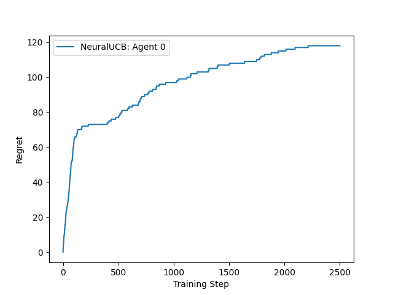

.. _neural_ucb_tutorial:

Iris with NeuralUCB
===================

In this tutorial, we will be training a NeuralUCB agent to solve the Iris dataset, converted into
a bandit environment.

To complete the Iris environment, the agent must learn to select the best arm, or action, to take
in a given context, or state.

  Figure 1: Cumulative regret from training on the Iris dataset

NeuralUCB (:ref:`Neural Contextual Bandits with UCB-based Exploration<neural_ucb>`) utilizes the representational capabilities
of deep neural networks and employs a neural network-based random feature mapping to create an upper
confidence bound (UCB) for reward, enabling efficient exploration.

.. literalinclude:: ../../../tutorials/Bandits/agilerl_neural_ucb.py
    :language: python
