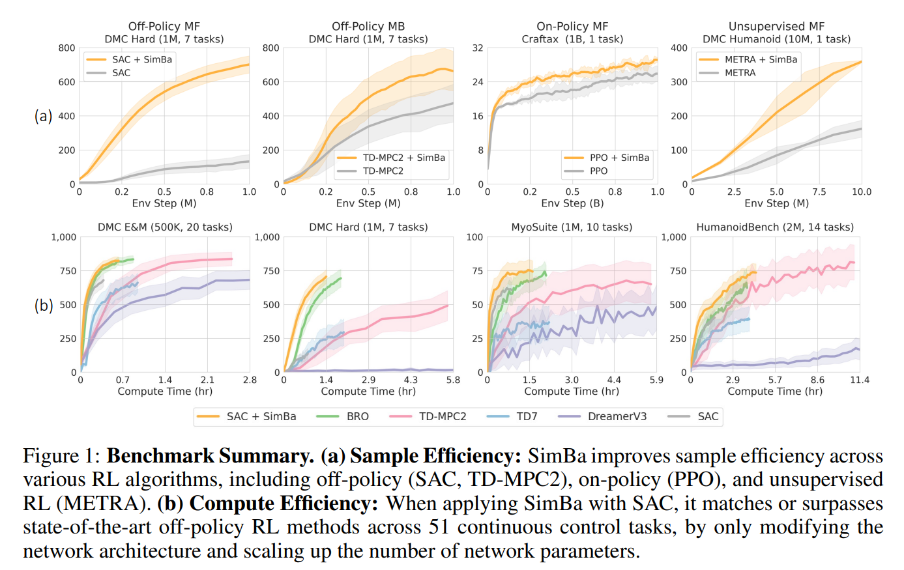

.. _simba_tutorial:

Integrating Architecture Mutations Into SimBa
=============================================

.. note::
    You can already plug-and-play with the SimBa architecture in any of the AgileRL algorithms for vector observation spaces! At the end of this tutorial we show
    an example of how users can do this for DDPG in the ``HalfCheetah-v4`` environment.

The paper `SimBa: Simplicity Bias for Scaling Up Parameters in Deep Reinforcement Learning <https://arxiv.org/abs/2410.09754>`_ introduced an architecture
designed to scale up parameters in deep RL by injecting a simplicity bias. It consists of three components that allow for better generalization in
overparameterized networks:

1. **Observation Normalization**: Standardize inputs with running statistics. In AgileRL this is achieved by wrapping agents with the :class:`RSNorm <agilerl.wrappers.agent.RSNorm>` wrapper.
2. **Skip Connections**: Residual feedforward blocks that provide skip connections between inputs and outputs.
3. **Layer Normalization**: Use of ``nn.LayerNorm`` to control feature magnitudes between residual blocks.

Combining these components has shown to improve performance in RL tasks proportionally with task complexity. In this tutorial, we will implement this architecture as an evolvable module that
allows us to mutate its hyperparameters during training, and show its integration into the :class:`EvolvableNetwork <agilerl.networks.base.EvolvableNetwork>` objects used across the AgileRL library.

Implementing EvolvableSimBa
---------------------------

The benefit of building this architecture as an evolvable module lies in the ability to find its optimal hyperparameters in a single training run without the need for manual tuning. Therefore, we
usually take a functional approach towards building the underlying neural networks in ``EvolvableModule`` objects from the set of hyperparameters that we wish to mutate. The
:class:`EvolvableSimBa <agilerl.modules.simba.EvolvableSimBa>` architecture is comprised of a linear layer followed by a number of residual blocks with skip connections and layer normalization. Finally,
the output is passed through a linear layer to match the desired output shape. The hyperparameters here are therefore the number of residual blocks and the number of nodes in their hidden layers. Below
we show our implementation of the SimBa residual block, as well as the function that creates the full architecture from these hyperparameters using PyTorch:

.. code-block:: python

    from typing import Optional, Dict
    from collections import OrderedDict

    import torch.nn as nn
    import torch.nn.functional as F
    import torch

    from agilerl.utils.evolvable_networks import get_activation

    class SimbaResidualBlock(nn.Module):
        """Creates a residual block designed to avoid overfitting in RL by inducing
        a simplicity bias.

        Paper: https://arxiv.org/abs/2410.09754

        :param hidden_size: Hidden size of the residual block
        :type hidden_size: int
        :param scale_factor: Scale factor, defaults to 4
        :type scale_factor: float
        :param device: Device, defaults to "cpu"
        :type device
        """

        def __init__(
            self, hidden_size: int, scale_factor: float = 4, device: DeviceType = "cpu"
        ) -> None:
            super().__init__()

            self.hidden_size = hidden_size

            self.layer_norm = nn.LayerNorm(hidden_size, device=device)
            self.linear1 = nn.Linear(hidden_size, hidden_size * scale_factor, device=device)
            self.linear2 = nn.Linear(hidden_size * scale_factor, hidden_size, device=device)

            # initialize weigts using he initialization
            nn.init.kaiming_uniform_(self.linear1.weight)
            nn.init.kaiming_uniform_(self.linear2.weight)

        def forward(self, x: torch.Tensor) -> torch.Tensor:
            res = x
            x = self.layer_norm(x)
            x = F.relu(self.linear1(x))
            x = self.linear2(x)
            return res + x

    def create_simba(
        input_size: int,
        output_size: int,
        hidden_size: int,
        num_blocks: int,
        output_activation: Optional[str] = None,
        scale_factor: float = 4.0,
        device: DeviceType = "cpu",
        name: str = "simba",
    ) -> nn.Sequential:
        """Creates a number of SimBa residual blocks.

        Paper: https://arxiv.org/abs/2410.09754.

        :param input_size: Number of input features.
        :type input_size: int
        :param output_size: Number of output features.
        :type output_size: int
        :param hidden_size: Number of hidden units.
        :type hidden_size: int
        :param num_blocks: Number of residual blocks.
        :type num_blocks: int
        :param output_activation: Activation function for output layer.
        :type output_activation: Optional[str]
        :param scale_factor: Scale factor for the hidden layer.
        :type scale_factor: float, optional
        :param device: Device to use. Defaults to "cpu".
        :type device: DeviceType, optional
        :param name: Name of the network.
        :type name: str, default "simba"

        :return: Residual block.
        :rtype: nn.Sequential
        """
        net_dict: Dict[str, nn.Module] = OrderedDict()

        # Initial dense layer
        net_dict[f"{name}_linear_layer_input"] = nn.Linear(
            input_size, hidden_size, device=device
        )
        nn.init.orthogonal_(net_dict[f"{name}_linear_layer_input"].weight)
        for l_no in range(1, num_blocks + 1):
            net_dict[f"{name}_residual_block_{str(l_no)}"] = SimbaResidualBlock(
                hidden_size, scale_factor=scale_factor, device=device
            )

        # Final layer norm and output dense
        net_dict[f"{name}_layer_norm_output"] = nn.LayerNorm(hidden_size, device=device)
        net_dict[f"{name}_linear_layer_output"] = nn.Linear(
            hidden_size, output_size, device=device
        )
        nn.init.orthogonal_(net_dict[f"{name}_linear_layer_output"].weight)

        net_dict[f"{name}_activation_output"] = get_activation(
            activation_name=output_activation
        )

        return nn.Sequential(net_dict)

Using the above functions we can now define :class:`EvolvableSimBa <agilerl.modules.simba.EvolvableSimBa>` and specify the ways in which we wish to
mutate its hyperparameters through class methods wrapped by the ``@mutation`` decorator. Below we show the implementation of the evolvable module:

.. code-block:: python

    from typing import Any, Dict, Optional

    import numpy as np
    import torch

    from agilerl.modules.base import EvolvableModule, MutationType, mutation
    from agilerl.typing import ObservationType
    from agilerl.utils.evolvable_networks import create_simba

    class EvolvableSimBa(EvolvableModule):
        """Evolvable module that implements the architecture presented in 'SimBa: Simplicity
        Bias for Scaling Up Parameters in Deep Reinforcement Learning'. Designed to avoid
        overfitting by integrating components that induce a simplicity bias, guiding models toward
        simple and generalizable solutions.

        Paper: https://arxiv.org/abs/2410.09754

        :param num_inputs: Input layer dimension
        :type num_inputs: int
        :param num_outputs: Output layer dimension
        :type num_outputs: int
        :param hidden_size: Hidden layer(s) size
        :type hidden_size: List[int]
        :param num_blocks: Number of residual blocks that compose the network
        :type num_blocks: int
        :param output_activation: Output activation layer, defaults to None
        :type output_activation: str, optional
        :param scale_factor: Scale factor for the network, defaults to 4
        :type scale_factor: int, optional
        :param min_blocks: Minimum number of residual blocks that compose the network, defaults to 1
        :type min_blocks: int, optional
        :param max_blocks: Maximum number of residual blocks that compose the network, defaults to 4
        :type max_blocks: int, optional
        :param min_mlp_nodes: Minimum number of nodes a layer can have within the network, defaults to 16
        :type min_mlp_nodes: int, optional
        :param max_mlp_nodes: Maximum number of nodes a layer can have within the network, defaults to 500
        :type max_mlp_nodes: int, optional
        :param device: Device for accelerated computing, 'cpu' or 'cuda', defaults to 'cpu'
        :type device: str, optional
        :param name: Name of the network, defaults to 'mlp'
        :type name: str, optional
        """

        def __init__(
            self,
            num_inputs: int,
            num_outputs: int,
            hidden_size: int,
            num_blocks: int,
            output_activation: str = None,
            scale_factor: int = 4,
            min_blocks: int = 1,
            max_blocks: int = 4,
            min_mlp_nodes: int = 16,
            max_mlp_nodes: int = 500,
            device: str = "cpu",
            name: str = "simba",
        ) -> None:
            super().__init__(device=device)

            assert isinstance(scale_factor, int), "Scale factor must be an integer."

            self.num_inputs = num_inputs
            self.num_outputs = num_outputs
            self.hidden_size = hidden_size
            self.num_blocks = num_blocks
            self.output_activation = output_activation
            self.scale_factor = scale_factor
            self.min_blocks = min_blocks
            self.max_blocks = max_blocks
            self.min_mlp_nodes = min_mlp_nodes
            self.max_mlp_nodes = max_mlp_nodes
            self.name = name

            self.model = create_simba(
                input_size=num_inputs,
                output_size=num_outputs,
                hidden_size=hidden_size,
                num_blocks=num_blocks,
                output_activation=output_activation,
                scale_factor=self.scale_factor,
                device=device,
                name=name,
            )

        @property
        def net_config(self) -> Dict[str, Any]:
            """Returns model configuration in dictionary."""
            net_config = self.init_dict.copy()
            for attr in ["num_inputs", "num_outputs", "device", "name"]:
                if attr in net_config:
                    net_config.pop(attr)

            return net_config

        def forward(self, x: ObservationType) -> torch.Tensor:
            """Returns output of neural network.

            :param x: Neural network input
            :type x: torch.Tensor
            :return: Neural network output
            :rtype: torch.Tensor
            """
            if not isinstance(x, torch.Tensor):
                x = torch.tensor(x, dtype=torch.float32, device=self.device)

            if len(x.shape) == 1:
                x = x.unsqueeze(0)

            return self.model(x)

        @mutation(MutationType.LAYER)
        def add_block(self) -> None:
            """Adds a hidden layer to neural network. Falls back on add_node if
            max hidden layers reached."""
            # add layer to hyper params
            if self.num_blocks < self.max_blocks:  # HARD LIMIT
                self.num_blocks += 1
            else:
                return self.add_node()

        @mutation(MutationType.LAYER)
        def remove_block(self) -> None:
            """Removes a hidden layer from neural network. Falls back on remove_node if
            min hidden layers reached."""
            if self.num_blocks > self.min_blocks:  # HARD LIMIT
                self.num_blocks -= 1
            else:
                return self.add_node()

        @mutation(MutationType.NODE)
        def add_node(self, numb_new_nodes: Optional[int] = None) -> Dict[str, int]:
            """Adds nodes to residual blocks of the neural network.

            :param numb_new_nodes: Number of nodes to add, defaults to None
            :type numb_new_nodes: int, optional
            """
            if numb_new_nodes is None:
                numb_new_nodes = np.random.choice([16, 32, 64], 1)[0]

            if self.hidden_size + numb_new_nodes <= self.max_mlp_nodes:  # HARD LIMIT
                self.hidden_size += numb_new_nodes

            return {"numb_new_nodes": numb_new_nodes}

        @mutation(MutationType.NODE)
        def remove_node(self, numb_new_nodes: Optional[int] = None) -> Dict[str, int]:
            """Removes nodes from hidden layer of neural network.

            :param hidden_layer: Depth of hidden layer to remove nodes from, defaults to None
            :type hidden_layer: int, optional
            :param numb_new_nodes: Number of nodes to remove from hidden layer, defaults to None
            :type numb_new_nodes: int, optional
            """
            if numb_new_nodes is None:
                numb_new_nodes = np.random.choice([16, 32, 64], 1)[0]

            # HARD LIMIT
            if self.hidden_size - numb_new_nodes > self.min_mlp_nodes:
                self.hidden_size -= numb_new_nodes

            return {"numb_new_nodes": numb_new_nodes}

        def recreate_network(self) -> None:
            """Recreates neural networks.

            :param shrink_params: Shrink parameters of neural networks, defaults to False
            :type shrink_params: bool, optional
            """
            model = create_simba(
                input_size=self.num_inputs,
                output_size=self.num_outputs,
                hidden_size=self.hidden_size,
                num_blocks=self.num_blocks,
                output_activation=self.output_activation,
                scale_factor=self.scale_factor,
                device=self.device,
                name=self.name,
            )

            self.model = EvolvableModule.preserve_parameters(
                old_net=self.model, new_net=model
            )

Using ``EvolvableSimBa`` in Evolvable Networks
----------------------------------------------

We allow users to specify whether they wish to use the SimBa architecture as an alternative to an ``EvolvableMLP`` encoder by using ``simba=True`` as argument to a
``EvolvableNetwork``. This means that you can plug-and-play with this architecture in any of the AgileRL algorithms for a vector observation space.

.. note::
    We don't allow this for the ``RainbowQNetwork`` due to the use of noisy linear layers which aren't used in the original SimBa paper. However, please feel
    free to experiment as you wish as this may be an interesting extension worth exploring!

End-to-End Example with DDPG on HalfCheetah-v4
-----------------------------------------------

Below we show an end-to-end example of using the ``EvolvableSimBa`` architecture in the DDPG algorithm for the ``HalfCheetah-v4`` environment, which includes quite a
complex vector observation space that will show the benefits of using the SimBa architecture. Remember to install gymnasium through ``pip install gymnasium[mujoco]``
to have access to the ``HalfCheetah-v4`` environment.

.. code-block:: python

    import torch

    from agilerl.algorithms.core.registry import HyperparameterConfig, RLParameter
    from agilerl.algorithms import DDPG
    from agilerl.wrappers.agent import RSNorm
    from agilerl.components.replay_buffer import ReplayBuffer
    from agilerl.hpo.mutation import Mutations
    from agilerl.hpo.tournament import TournamentSelection
    from agilerl.training.train_off_policy import train_off_policy
    from agilerl.utils.utils import make_vect_envs, print_hyperparams

    # Device
    device = torch.device("cuda" if torch.cuda.is_available() else "cpu")

    # Create vectorized environment for HalfCheetah-v4
    env_name = "HalfCheetah-v4"
    num_envs = 6
    env = make_vect_envs(env_name, num_envs=num_envs)

    observation_space = env.single_observation_space
    action_space = env.single_action_space

    # Replay buffer for off-policy learning
    field_names = ["state", "action", "reward", "next_state", "done"]
    memory_size = 100_000
    memory = ReplayBuffer(
        memory_size=memory_size,
        field_names=field_names,
        device=device
    )

    # Tournament selection and mutations
    population_size = 4
    tournament = TournamentSelection(
        tournament_size=2,
        elitism=True,
        population_size=population_size,
        eval_loop=1
    )

    # Hyperarameter mutation probabilities
    mutations = Mutations(
        no_mutation=0.4, # No mutation
        architecture=0.2, # Architecture mutation
        new_layer_prob=0.2, # Mutate layer number (0.2) vs mutate node number (0.8)
        parameters=0.2, # Mutate parameters with Gaussian noise
        activation=0.2, # Mutate activation function
        rl_hp=0.2, # Mutate RL hyperparameters
        mutation_sd=0.1, # Mutation strength
        rand_seed=42, # Random seed
        device=device,
    )

    # RL hyperparameters mutation configuration
    hp_config = HyperparameterConfig(
        lr_actor=RLParameter(min=1e-4, max=1e-2),
        lr_critic=RLParameter(min=1e-4, max=1e-2),
        batch_size=RLParameter(min=8, max=512, dtype=int),
        learn_step=RLParameter(min=1, max=16, dtype=int, grow_factor=1.5, shrink_factor=0.75)
    )

    # Architecture of networks in algorithm
    net_config = {
        "latent_dim": 64, # Latent dimension of evolvable networks
        "simba": True, # Use EvolvableSimBa as encoder for vector space

        # Configuration of EvolvableSimBa encoder
        "encoder_config": {
            "hidden_size": 128, # Hidden size of residual blocks
            "num_blocks": 2, # Number of residual blocks
            "min_mlp_nodes": 64, # Minimum number of nodes for architecture mutations
            "max_mlp_nodes": 500 # Maximum number of nodes for architecture mutations
        },

        # Configuration of EvolvableMLP head
        "head_config": {
            "hidden_size": [64],
            "activation": "ReLU",
            "output_activation": "Tanh",
            "min_hidden_layers": 1,
            "max_hidden_layers": 2,
            "min_mlp_nodes": 64,
            "max_mlp_nodes": 500
        }
    }

    # Create population of DDPG agents
    agent_pop = DDPG.population(
        size=population_size,
        observation_space=observation_space,
        action_space=action_space,
        wrapper_cls=RSNorm, # IMPORTANT: Use RSNorm agent wrapper for input normalization like in paper
        O_U_noise=True,
        expl_noise=0.1,
        vect_noise_dim=num_envs,
        mean_noise=0.0,
        theta=0.15,
        dt=1e-2,
        hp_config=hp_config,
        net_config=net_config,
        batch_size=128,
        lr_actor=3e-4,
        lr_critic=3e-4,
        learn_step=1,
        gamma=0.99,
        tau=5e-3,
        policy_freq=2,
        device=device
    )

    trained_pop, pop_fitnesses = train_off_policy(
        env,
        env_name,
        "DDPG",
        agent_pop,
        memory=memory,
        max_steps=1_000_000,
        evo_steps=15_000,
        eval_loop=1,
        learning_delay=10_000,
        tournament=tournament,
        mutation=mutations
    )

    print_hyperparams(trained_pop)
    env.close()
