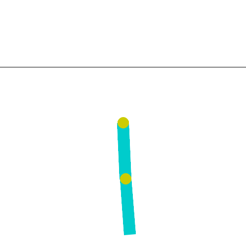

.. _ppo_tutorial:

Acrobot with PPO
==========================

In this tutorial, we will be training and optimising the hyperparameters of a population of PPO agents
to beat the Gymnasium acrobot environment. AgileRL is a deep reinforcement learning
library, focussed on improving the RL training process through evolutionary hyperparameter
optimisation (HPO), which has resulted in upto 10x faster HPO compared to other popular deep RL
libraries. Check out the AgileRL github
`repository <https://github.com/AgileRL/AgileRL/>`__
for more information about the library.

To complete the acrobot environment, the agent must learn to apply torques on the joint to swing the free end
of the linear chain above the black line from an initial state of hanging stationary.

  Figure 1: Completed Acrobot environment using an AgileRL PPO agent

PPO Overview
------------
PPO (proximal policy optimisation) is an on-policy algorithm that uses policy gradient methods
to directly optimise the policy function, which determines the agent's actions based on the
environment's state. PPO strikes an effective balance between exploration and exploitation, making
it robust in learning diverse tasks.

Dependencies
------------

.. code-block:: python

    # Author: Michael Pratt
    import os

    import imageio
    import gymnasium as gym
    import numpy as np
    import torch
    from agilerl.algorithms.ppo import PPO
    from agilerl.hpo.mutation import Mutations
    from agilerl.hpo.tournament import TournamentSelection
    from agilerl.training.train_on_policy import train_on_policy
    from agilerl.utils.utils import create_population, make_vect_envs
    from tqdm import trange

Defining Hyperparameters
------------------------
Before we commence training, it's easiest to define all of our hyperparameters in one dictionary. Below is an example of
such for the PPO algorithm. Additionally, we also define a mutations parameters dictionary, in which we determine what
mutations we want to happen, to what extent we want these mutations to occur, and what RL hyperparameters we want to tune.
Additionally, we also define our upper and lower limits for these hyperparameters to define search spaces.

.. code-block:: python

    # Initial hyperparameters
    INIT_HP = {
        "POP_SIZE": 4,  # Population size
        "DISCRETE_ACTIONS": True,  # Discrete action space
        "BATCH_SIZE": 128,  # Batch size
        "LR": 0.001,  # Learning rate
        "LEARN_STEP": 1024,  # Learning frequency
        "GAMMA": 0.99,  # Discount factor
        "GAE_LAMBDA": 0.95,  # Lambda for general advantage estimation
        "ACTION_STD_INIT": 0.6,  # Initial action standard deviation
        "CLIP_COEF": 0.2,  # Surrogate clipping coefficient
        "ENT_COEF": 0.01,  # Entropy coefficient
        "VF_COEF": 0.5,  # Value function coefficient
        "MAX_GRAD_NORM": 0.5,  # Maximum norm for gradient clipping
        "TARGET_KL": None,  # Target KL divergence threshold
        "UPDATE_EPOCHS": 4,  # Number of policy update epochs
        # Swap image channels dimension from last to first [H, W, C] -> [C, H, W]
        "CHANNELS_LAST": False,  # Use with RGB states
        "TARGET_SCORE": 200.0,  # Target score that will beat the environment
        "MAX_STEPS": 150000,  # Maximum number of steps an agent takes in an environment
        "EVO_STEPS": 10000,  # Evolution frequency
        "EVAL_STEPS": None,  # Number of evaluation steps per episode
        "EVAL_LOOP": 3,  # Number of evaluation episodes
        "TOURN_SIZE": 2,  # Tournament size
        "ELITISM": True,  # Elitism in tournament selection
    }

    # Mutation parameters
    MUT_P = {
        # Mutation probabilities
        "NO_MUT": 0.4,  # No mutation
        "ARCH_MUT": 0.2,  # Architecture mutation
        "NEW_LAYER": 0.2,  # New layer mutation
        "PARAMS_MUT": 0.2,  # Network parameters mutation
        "ACT_MUT": 0.2,  # Activation layer mutation
        "RL_HP_MUT": 0.2,  # Learning HP mutation
        # Learning HPs to choose from
        "RL_HP_SELECTION": ["lr", "batch_size", "learn_step"],
        "MUT_SD": 0.1,  # Mutation strength
        "RAND_SEED": 42,  # Random seed
        # Define max and min limits for mutating RL hyperparams
        "MIN_LR": 0.0001,
        "MAX_LR": 0.01,
        "MIN_BATCH_SIZE": 8,
        "MAX_BATCH_SIZE": 1024,
        "MIN_LEARN_STEP": 256,
        "MAX_LEARN_STEP": 8192,
    }

Create the Environment
----------------------
In this particular tutorial, we will be focussing on the acrobot environment as you can use PPO with
either discrete or continuous action spaces. The snippet below creates a vectorised environment and then assigns the
correct values for ``state_dim`` and ``one_hot``, depending on whether the observation or action spaces are discrete
or continuous.

.. code-block:: python

    num_envs=8
    env = make_vect_envs("Acrobot-v1", num_envs=num_envs)  # Create environment
    try:
        state_dim = env.single_observation_space.n, # Discrete observation space
        one_hot = True  # Requires one-hot encoding
    except Exception:
        state_dim = env.single_observation_space.shape  # Continuous observation space
        one_hot = False  # Does not require one-hot encoding
    try:
        action_dim = env.single_action_space.n  # Discrete action space
    except Exception:
        action_dim = env.single_action_space.shape[0]  # Continuous action space

    if INIT_HP["CHANNELS_LAST"]:
        # Adjust dimensions for PyTorch API (C, H, W), for envs with RGB image states
        state_dim = (state_dim[2], state_dim[0], state_dim[1])

Create a Population of Agents
-----------------------------
To perform evolutionary HPO, we require a population of agents. Since PPO is an on-policy algorithm, there is no
experience replay and so members in the population will not share experiences like they do with off-policy algorithms.
That being said, tournament selection and mutation still prove to be highly effective in determining the effacacy of
certain hyperparameters. Individuals that learn best are more likely to survive until the next generation, and so their
hyperparameters are more likely to remain present in the population. The sequence of evolution (tournament selection
followed by mutations) is detailed further below.

.. code-block:: python

    # Set-up the device
    device = "cuda" if torch.cuda.is_available() else "cpu"

    # Define the network configuration of a simple mlp with two hidden layers, each with 64 nodes
    net_config = {"arch": "mlp", "hidden_size": [64, 64]}

    # Define a population
    pop = create_population(
        algo="PPO",  # Algorithm
        state_dim=state_dim,  # State dimension
        action_dim=action_dim,  # Action dimension
        one_hot=one_hot,  # One-hot encoding
        net_config=net_config,  # Network configuration
        INIT_HP=INIT_HP,  # Initial hyperparameter
        population_size=INIT_HP["POP_SIZE"],  # Population size
        num_envs=num_envs,
        device=device,
    )

Creating Mutations and Tournament objects
-----------------------------------------
Tournament selection is used to select the agents from a population which will make up the next generation of agents. If
elitism is used, the best agent from a population is automatically preserved and becomes a member of the next generation.
Then, for each tournament, k individuals are randomly chosen, and the agent with the best evaluation fitness is preserved.
This is repeated until the population for the next generation is full.

The class ``TournamentSelection()`` defines the functions required for tournament selection. TournamentSelection.select()
returns the best agent, and the new generation of agents.

.. code-block:: python

    tournament = TournamentSelection(
        INIT_HP["TOURN_SIZE"],
        INIT_HP["ELITISM"],
        INIT_HP["POP_SIZE"],
        INIT_HP["EVAL_LOOP"],
    )

Mutation is periodically used to explore the hyperparameter space, allowing different hyperparameter combinations to be
trialled during training. If certain hyperparameters prove relatively beneficial to training, then that agent is more
likely to be preserved in the next generation, and so those characteristics are more likely to remain in the population.

The ``Mutations()`` class is used to mutate agents with pre-set probabilities. The available mutations currently implemented are:

* No mutation
* Network architecture mutation - adding layers or nodes. Trained weights are reused and new weights are initialized randomly.
* Network parameters mutation - mutating weights with Gaussian noise.
* Network activation layer mutation - change of activation layer.
* RL algorithm mutation - mutation of learning hyperparameter, such as learning rate or batch size.

``Mutations.mutation()`` returns a mutated population.
Tournament selection and mutation should be applied sequentially to fully evolve a population between evaluation and learning cycles.

.. code-block:: python

    mutations = Mutations(
        algo="PPO",
        no_mutation=MUT_P["NO_MUT"],
        architecture=MUT_P["ARCH_MUT"],
        new_layer_prob=MUT_P["NEW_LAYER"],
        parameters=MUT_P["PARAMS_MUT"],
        activation=MUT_P["ACT_MUT"],
        rl_hp=MUT_P["RL_HP_MUT"],
        rl_hp_selection=MUT_P["RL_HP_SELECTION"],
        min_lr=MUT_P["MIN_LR"],
        max_lr=MUT_P["MAX_LR"],
        min_batch_size=MUT_P["MAX_BATCH_SIZE"],
        max_batch_size=MUT_P["MAX_BATCH_SIZE"],
        min_learn_step=MUT_P["MIN_LEARN_STEP"],
        max_learn_step=MUT_P["MAX_LEARN_STEP"],
        mutation_sd=MUT_P["MUT_SD"],
        arch=net_config["arch"],
        rand_seed=MUT_P["RAND_SEED"],
        device=device,
    )

Training and Saving an Agent
----------------------------

Using AgileRL ``train_on_policy`` function
~~~~~~~~~~~~~~~~~~~~~~~~~~~~~~~~~~~~~~~~~~
The simplest way to train an AgileRL agent is to use one of the implemented AgileRL train functions.
Given that PPO is an on-policy algorithm, we can make use of the ``train_on_policy`` function. This
training function will orchestrate the training and hyperparameter optimisation process, removing the
the need to implement a training loop. It will return a trained population, as well as the associated
fitnesses (fitness is each agents test scores on the environment).

.. code-block:: python

    # Define a save path for our trained agent
    save_path = "PPO_trained_agent.pt"

    trained_pop, pop_fitnesses = train_on_policy(
        env=env,
        env_name="Acrobot-v1",
        algo="PPO",
        pop=pop,
        INIT_HP=INIT_HP,
        MUT_P=MUT_P,
        swap_channels=INIT_HP["CHANNELS_LAST"],
        max_steps=INIT_HP["MAX_STEPS"],
        evo_steps=INIT_HP["EVO_STEPS"],
        eval_steps=INIT_HP["EVAL_STEPS"],
        eval_loop=INIT_HP["EVAL_LOOP"],
        tournament=tournament,
        mutation=mutations,
        wb=False,  # Boolean flag to record run with Weights & Biases
        save_elite=True,  # Boolean flag to save the elite agent in the population
        elite_path=save_path,
    )

Using a custom training loop
~~~~~~~~~~~~~~~~~~~~~~~~~~~~
If we wanted to have more control over the training process, it is also possible to write our own custom
training loops to train our agents. The training loop below can be used alternatively to the above ``train_on_policy``
function and is an example of how we might choose to make use of a population of AgileRL agents in our own training loop.

.. code-block:: python

    total_steps = 0

    # TRAINING LOOP
    print("Training...")
    pbar = trange(INIT_HP["MAX_STEPS"], unit="step")
    while np.less([agent.steps[-1] for agent in pop], INIT_HP["MAX_STEPS"]).all():
        pop_episode_scores = []
        for agent in pop:  # Loop through population
            state, info = env.reset()  # Reset environment at start of episode
            scores = np.zeros(num_envs)
            completed_episode_scores = []
            steps = 0

            for _ in range(-(INIT_HP["EVO_STEPS"] // -agent.learn_step)):

                states = []
                actions = []
                log_probs = []
                rewards = []
                dones = []
                values = []

                learn_steps = 0

                for idx_step in range(-(agent.learn_step // -num_envs)):
                    if INIT_HP["CHANNELS_LAST"]:
                        state = np.moveaxis(state, [-1], [-3])

                    # Get next action from agent
                    action, log_prob, _, value = agent.get_action(state)

                    # Act in environment
                    next_state, reward, terminated, truncated, info = env.step(action)

                    total_steps += num_envs
                    steps += num_envs
                    learn_steps += num_envs

                    states.append(state)
                    actions.append(action)
                    log_probs.append(log_prob)
                    rewards.append(reward)
                    dones.append(terminated)
                    values.append(value)

                    state = next_state
                    scores += np.array(reward)

                    for idx, (d, t) in enumerate(zip(terminated, truncated)):
                        if d or t:
                            completed_episode_scores.append(scores[idx])
                            agent.scores.append(scores[idx])
                            scores[idx] = 0

                pbar.update(learn_steps // len(pop))

                if INIT_HP["CHANNELS_LAST"]:
                    next_state = np.moveaxis(next_state, [-1], [-3])

                experiences = (
                    states,
                    actions,
                    log_probs,
                    rewards,
                    dones,
                    values,
                    next_state,
                )
                # Learn according to agent's RL algorithm
                agent.learn(experiences)

            agent.steps[-1] += steps
            pop_episode_scores.append(completed_episode_scores)

        # Evaluate population
        fitnesses = [
            agent.test(
                env,
                swap_channels=INIT_HP["CHANNELS_LAST"],
                max_steps=INIT_HP["EVAL_STEPS"],
                loop=INIT_HP["EVAL_LOOP"],
            )
            for agent in pop
        ]
        mean_scores = [
            (
                np.mean(episode_scores)
                if len(episode_scores) > 0
                else "0 completed episodes"
            )
            for episode_scores in pop_episode_scores
        ]

        print(f"--- Global steps {total_steps} ---")
        print(f"Steps {[agent.steps[-1] for agent in pop]}")
        print(f"Scores: {mean_scores}")
        print(f'Fitnesses: {["%.2f"%fitness for fitness in fitnesses]}')
        print(
            f'5 fitness avgs: {["%.2f"%np.mean(agent.fitness[-5:]) for agent in pop]}'
        )

        # Tournament selection and population mutation
        elite, pop = tournament.select(pop)
        pop = mutations.mutation(pop)

        # Update step counter
        for agent in pop:
            agent.steps.append(agent.steps[-1])

    # Save the trained algorithm
    elite.save_checkpoint(save_path)

    pbar.close()
    env.close()

Loading an Agent for Inference and Rendering your Solved Environment
--------------------------------------------------------------------
Once we have trained and saved an agent, we may want to then use our trained agent for inference. Below outlines
how we would load a saved agent and how it can then be used in a testing loop.

Load agent
~~~~~~~~~~
.. code-block:: python

    ppo = PPO.load(save_path, device=device)

Test loop for inference
~~~~~~~~~~~~~~~~~~~~~~~

.. code-block:: python

    test_env = gym.make("Acrobot-v1", render_mode="rgb_array")
    rewards = []
    frames = []
    testing_eps = 7
    max_testing_steps = 1000
    with torch.no_grad():
        for ep in range(testing_eps):
            state = test_env.reset()[0]  # Reset environment at start of episode
            score = 0

            for step in range(max_testing_steps):
                # If your state is an RGB image
                if INIT_HP["CHANNELS_LAST"]:
                    state = np.moveaxis(state, [-1], [-3])

                # Get next action from agent
                action, *_ = ppo.get_action(state)
                action = action.squeeze()

                # Save the frame for this step and append to frames list
                frame = test_env.render()
                frames.append(frame)

                # Take the action in the environment
                state, reward, terminated, truncated, _ = test_env.step(action)

                # Collect the score
                score += reward

                # Break if environment 0 is done or truncated
                if terminated or truncated:
                    break

            # Collect and print episodic reward
            rewards.append(score)
            print("-" * 15, f"Episode: {ep}", "-" * 15)
            print("Episodic Reward: ", rewards[-1])

        test_env.close()

Save test episosdes as a gif
~~~~~~~~~~~~~~~~~~~~~~~~~~~~
.. code-block:: python

    gif_path = "./videos/"
    os.makedirs(gif_path, exist_ok=True)
    imageio.mimwrite(os.path.join("./videos/", "ppo_acrobot.gif"), frames, loop=0)
    mean_fitness = np.mean(rewards)
