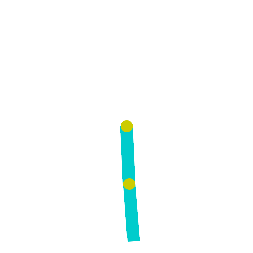

.. _ppo_tutorial:

Acrobot with PPO
=================

In this tutorial, we will be training and optimising the hyperparameters of a population of PPO agents
to beat the Gymnasium acrobot environment. AgileRL is a deep reinforcement learning
library, focussed on improving the RL training process through evolutionary hyperparameter
optimisation (HPO), which has resulted in up to 10x faster HPO compared to other popular deep RL
libraries. Check out the AgileRL github
`repository <https://github.com/AgileRL/AgileRL/>`__
for more information about the library.

To complete the acrobot environment, the agent must learn to apply torques on the joint to swing the free end
of the linear chain above the black line from an initial state of hanging stationary.

  Figure 1: Completed Acrobot environment using an AgileRL PPO agent

PPO Overview
------------
PPO (proximal policy optimisation) is an on-policy algorithm that uses policy gradient methods
to directly optimise the policy function, which determines the agent's actions based on the
environment's state. PPO strikes an effective balance between exploration and exploitation, making
it robust in learning diverse tasks.

Dependencies
------------

.. code-block:: python

    # Author: Michael Pratt
    import os

    from tqdm import trange
    import imageio
    import gymnasium as gym
    import numpy as np
    import torch

    from agilerl.algorithms import PPO
    from agilerl.algorithms.core.registry import HyperparameterConfig, RLParameter
    from agilerl.hpo.mutation import Mutations
    from agilerl.hpo.tournament import TournamentSelection
    from agilerl.training.train_on_policy import train_on_policy
    from agilerl.utils.utils import make_vect_envs
    from agilerl.rollouts.on_policy import collect_rollouts

Defining Hyperparameters
------------------------
Before we commence training, it's easiest to define all of our hyperparameters in one dictionary. Below is an example of
such for the PPO algorithm. Additionally, we also define a mutations parameters dictionary, in which we determine what
mutations we want to happen, to what extent we want these mutations to occur, and what RL hyperparameters we want to tune.
Additionally, we also define our upper and lower limits for these hyperparameters to define search spaces.

.. collapse:: Hyperparameter Configuration

    .. code-block:: python

        # Define the network configuration of a simple mlp with two hidden layers, each with 64 nodes
        net_config = {"head_config": {"hidden_size": [64, 64]}}

        # RL hyperparameters configuration for mutation during training
        hp_config = HyperparameterConfig(
            lr = RLParameter(min=1e-4, max=1e-2),
            batch_size = RLParameter(min=8, max=1024),
            learn_step = RLParameter(min=1, max=10, grow_factor=1.5, shrink_factor=0.75),
            ent_coef=RLParameter(min=0.0001, max=0.001, grow_factor=1.0, shrink_factor=0.9),
        )

        # Algorithm hyperparameters
        init_hp = {
            "batch_size": 128,
            "lr": 0.001,
            "learn_step": 1024,
            "gamma": 0.99,
            "gae_lambda": 0.95,
            "action_std_init": 0.6,
            "clip_coef": 0.2,
            "ent_coef": 0.01,
            "vf_coef": 0.5,
            "max_grad_norm": 0.5,
            "target_kl": None,
            "update_epochs": 4,
            "num_envs": num_envs,
            "hp_config": hp_config,
            "net_config": net_config,
        }

Create the Environment
----------------------
In this particular tutorial, we will be focussing on the acrobot environment as you can use PPO with
either discrete or continuous action spaces. The snippet below creates a vectorised environment and
initialises the population of agents from the corresponding observation and action spaces.

.. code-block:: python

    num_envs = 8
    env = make_vect_envs("Acrobot-v1", num_envs=num_envs)  # Create environment

    observation_space = env.single_observation_space
    action_space = env.single_action_space

Create a Population of Agents
-----------------------------
To perform evolutionary HPO, we require a population of agents. Since PPO is an on-policy algorithm, there is no
experience replay and so members in the population will not share experiences like they do with off-policy algorithms.
That being said, tournament selection and mutation still prove to be highly effective in determining the efficacy of
certain hyperparameters. Individuals that learn best are more likely to survive until the next generation, and so their
hyperparameters are more likely to remain present in the population. The sequence of evolution (tournament selection
followed by mutations) is detailed further below.

.. code-block:: python

    # Define a population
    population_size = 4
    pop = PPO.population(
        size=population_size,
        observation_space=observation_space,
        action_space=action_space,
        device="cuda" if torch.cuda.is_available() else "cpu",
        **init_hp,
    )

Creating Mutations and Tournament Objects
-----------------------------------------
Tournament selection is used to select the agents from a population which will make up the next generation of agents. If
elitism is used, the best agent from a population is automatically preserved and becomes a member of the next generation.
Then, for each tournament, k individuals are randomly chosen, and the agent with the best evaluation fitness is preserved.
This is repeated until the population for the next generation is full.

The class ``TournamentSelection()`` defines the functions required for tournament selection. TournamentSelection.select()
returns the best agent, and the new generation of agents.

.. code-block:: python

    tournament = TournamentSelection(
        tournament_size=2,
        elitism=True,
        population_size=population_size,
    )

Mutation is periodically used to explore the hyperparameter space, allowing different hyperparameter combinations to be
trialled during training. If certain hyperparameters prove relatively beneficial to training, then that agent is more
likely to be preserved in the next generation, and so those characteristics are more likely to remain in the population.

The ``Mutations()`` class is used to mutate agents with pre-set probabilities. The available mutations currently implemented are:

* No mutation
* Network architecture mutation - adding layers or nodes. Trained weights are reused and new weights are initialized randomly.
* Network parameters mutation - mutating weights with Gaussian noise.
* Network activation layer mutation - change of activation layer.
* RL algorithm mutation - mutation of learning hyperparameter, such as learning rate or batch size.

``Mutations.mutation(population)`` returns a mutated population.

Tournament selection and mutation should be applied sequentially to fully evolve a population between evaluation and learning cycles.

.. code-block:: python

    mutations = Mutations(
        no_mutation=0.4,
        architecture=0.2,
        new_layer_prob=0.2,
        parameters=0.2,
        activation=0.2,
        rl_hp=0.2,
        mutation_sd=0.1,
        rand_seed=42,
        device=device,
    )

Training and Saving an Agent
----------------------------

Using AgileRL ``train_on_policy`` function
~~~~~~~~~~~~~~~~~~~~~~~~~~~~~~~~~~~~~~~~~~
The simplest way to train an AgileRL agent is to use one of the implemented AgileRL train functions.
Given that PPO is an on-policy algorithm, we can make use of the ``train_on_policy`` function. This
training function will orchestrate the training and hyperparameter optimisation process, removing the
the need to implement a training loop. It will return a trained population, as well as the associated
fitnesses (fitness is each agents test scores on the environment).

.. code-block:: python

    # Define a save path for our trained agent
    save_path = "PPO_trained_agent.pt"

    # Training parameters
    max_steps = 200000
    evo_steps = 10000
    eval_steps = None
    eval_loop = 1

    trained_pop, pop_fitnesses = train_on_policy(
        env=env,
        env_name="Acrobot-v1",
        algo="PPO",
        pop=pop,
        init_hp=init_hp,
        max_steps=max_steps,
        evo_steps=evo_steps,
        eval_steps=eval_steps,
        eval_loop=eval_loop,
        tournament=tournament,
        mutation=mutations,
        wb=False,  # Boolean flag to record run with Weights & Biases
        save_elite=True,  # Boolean flag to save the elite agent in the population
        elite_path=save_path,
    )

.. note::

   Known `Gymnasium issue <https://github.com/Farama-Foundation/Gymnasium/issues/722>`_ - running vectorize environments as top-level code (without ``if __name__ == "__main__":``) may cause multiprocessing errors. To fix, run the above as a method under ``main``, e.g.

   .. code-block:: python

      def train_agent():
          # ... training code

      if __name__ == "__main__":
          train_agent()

Using a Custom Training Loop
~~~~~~~~~~~~~~~~~~~~~~~~~~~~
If we wanted to have more control over the training process, it is also possible to write our own custom
training loops to train our agents. The training loop below can be used alternatively to the above ``train_on_policy``
function and is an example of how we might choose to make use of a population of AgileRL agents in our own training loop.

.. collapse:: Custom Training Loop

    .. code-block:: python

        total_steps = 0

        # TRAINING LOOP
        pbar = trange(max_steps, unit="step")
        while np.less([agent.steps for agent in pop], max_steps).all():
            pop_episode_scores = []
            for agent in pop:  # Loop through population
                collect_rollouts(agent, env)
                agent.learn() # Learn according to agent's RL algorithm

                agent.steps += steps
                pop_episode_scores.append(completed_episode_scores)

            # Evaluate population
            fitnesses = [
                agent.test(
                    env,
                    max_steps=eval_steps,
                    loop=eval_loop,
                )
                for agent in pop
            ]
            mean_scores = [
                (
                    np.mean(episode_scores)
                    if len(episode_scores) > 0
                    else "0 completed episodes"
                )
                for episode_scores in pop_episode_scores
            ]

            print(f"--- Global steps {total_steps} ---")
            print(f"Steps {[agent.steps for agent in pop]}")
            print(f"Scores: {mean_scores}")
            print(f'Fitnesses: {["%.2f"%fitness for fitness in fitnesses]}')
            print(
                f'5 fitness avgs: {["%.2f"%np.mean(agent.fitness[-5:]) for agent in pop]}'
            )

            # Tournament selection and population mutation
            elite, pop = tournament.select(pop)
            pop = mutations.mutation(pop)

        # Save the trained algorithm
        elite.save_checkpoint(save_path)

        pbar.close()
        env.close()

Loading an Agent for Inference and Rendering your Solved Environment
--------------------------------------------------------------------
Once we have trained and saved an agent, we may want to then use our trained agent for inference. Below outlines
how we would load a saved agent and how it can then be used in a testing loop.

Load agent
~~~~~~~~~~
.. code-block:: python

    ppo = PPO.load(save_path, device=device)

Test loop for inference
~~~~~~~~~~~~~~~~~~~~~~~

.. code-block:: python

    test_env = gym.make("Acrobot-v1", render_mode="rgb_array")
    rewards = []
    frames = []
    testing_eps = 7
    max_testing_steps = 1000
    with torch.no_grad():
        for ep in range(testing_eps):
            obs = test_env.reset()[0]  # Reset environment at start of episode
            score = 0

            for step in range(max_testing_steps):
                # Get next action from agent
                action, *_ = ppo.get_action(obs)
                action = action.squeeze()

                # Save the frame for this step and append to frames list
                frame = test_env.render()
                frames.append(frame)

                # Take the action in the environment
                obs, reward, terminated, truncated, _ = test_env.step(action)

                # Collect the score
                score += reward

                # Break if environment 0 is done or truncated
                if terminated or truncated:
                    break

            # Collect and print episodic reward
            rewards.append(score)
            print("-" * 15, f"Episode: {ep}", "-" * 15)
            print("Episodic Reward: ", rewards[-1])

        test_env.close()

Save test episosdes as a gif
~~~~~~~~~~~~~~~~~~~~~~~~~~~~
.. code-block:: python

    gif_path = "./videos/"
    os.makedirs(gif_path, exist_ok=True)
    imageio.mimwrite(os.path.join("./videos/", "ppo_acrobot.gif"), frames, loop=0)
    mean_fitness = np.mean(rewards)
