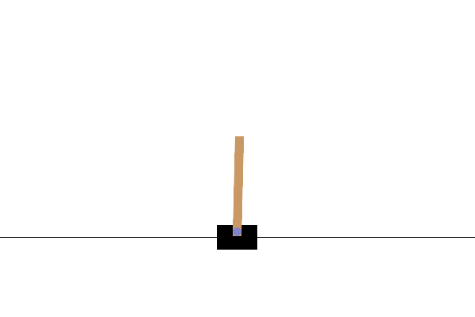

.. _rainbow_tutorial:

Cartpole with Rainbow DQN
==================================

In this tutorial, we will be training a single Rainbow-DQN agent (without HPO) to beat the
Gymnasium classic control cartpole environment. AgileRL is a deep reinforcement learning
library, focussed on improving the RL training process through evolutionary hyperparameter
optimisation (HPO), which has resulted in up to 10x faster HPO compared to other popular deep RL
libraries. Check out the AgileRL github `repository <https://github.com/AgileRL/AgileRL/>`__ for
more information about the library.

To complete the cartpole environment, the agent must learn to move the cart left or right to prevent
the pole from falling.

  Figure 1: Completed Cart-pole environment using an AgileRL Rainbow DQN agent

Rainbow-DQN Overview
--------------------
Rainbow DQN is an extension of DQN that integrates multiple improvements and techniques to achieve
state-of-the-art performance. These improvements include:

* Double DQN (DDQN): Addresses the overestimation bias of Q-values by using two networks to decouple
  the selection and evaluation of the action in the Q-learning target.
* Prioritized Experience Replay: Instead of uniformly sampling from the replay buffer, it samples more
  important transitions more frequently based on the magnitude of their temporal difference (TD) error.
* Dueling Networks: Splits the Q-network into two separate streams — one for estimating the state value
  function and another for estimating the advantages for each action. They are then combined to produce
  Q-values.
* Multi-step Learning (n-step returns): Instead of using just the immediate reward for learning, it uses
  multi-step returns which consider a sequence of future rewards.
* Distributional RL: Instead of estimating the expected value of the cumulative future reward, it predicts
  the entire distribution of the cumulative future reward.
* Noisy Nets: Adds noise directly to the weights of the network, providing a way to explore the environment
  without the need for epsilon-greedy exploration.
* Categorical DQN (C51): A specific form of distributional RL where the continuous range of possible
  cumulative future rewards is discretized into a fixed set of categories.

Dependencies
------------

.. code-block:: python

    # Author: Michael Pratt
    import os

    import imageio
    import gymnasium as gym
    import numpy as np
    import torch
    from agilerl.algorithms.dqn_rainbow import RainbowDQN
    from agilerl.components.replay_buffer import (
        MultiStepReplayBuffer,
        PrioritizedReplayBuffer,
    )
    from agilerl.training.train_off_policy import train_off_policy
    from agilerl.utils.utils import make_vect_envs
    from tqdm import trange

Defining Hyperparameters
------------------------
Before we commence training, it's easiest to define all of our hyperparameters in one dictionary. Below is an example of
such for the Rainbow-DQN algorithm. For this example, we are training a single agent without hyperparameter optimisation,
so we will not be performing mutations or tournament selection like we have in our other tutorials where we have. As this
is the case, we do not need to define a mutatinos parameters dictionary.

.. code-block:: python

    # Initial hyperparameters
    INIT_HP = {
        "BATCH_SIZE": 64,  # Batch size
        "LR": 0.0001,  # Learning rate
        "GAMMA": 0.99,  # Discount factor
        "MEMORY_SIZE": 100_000,  # Max memory buffer size
        "LEARN_STEP": 1,  # Learning frequency
        "N_STEP": 3,  # Step number to calculate td error
        "PER": True,  # Use prioritized experience replay buffer
        "ALPHA": 0.6,  # Prioritized replay buffer parameter
        "BETA": 0.4,  # Importance sampling coefficient
        "TAU": 0.001,  # For soft update of target parameters
        "PRIOR_EPS": 0.000001,  # Minimum priority for sampling
        "NUM_ATOMS": 51,  # Unit number of support
        "V_MIN": -200.0,  # Minimum value of support
        "V_MAX": 200.0,  # Maximum value of support
        "NOISY": True,  # Add noise directly to the weights of the network
        # Swap image channels dimension from last to first [H, W, C] -> [C, H, W]
        "LEARNING_DELAY": 1000,  # Steps before starting learning
        "CHANNELS_LAST": False,  # Use with RGB states
        "TARGET_SCORE": 200.0,  # Target score that will beat the environment
        "MAX_STEPS": 200000,  # Maximum number of steps an agent takes in an environment
        "EVO_STEPS": 10000,  # Evolution frequency
        "EVAL_STEPS": None,  # Number of evaluation steps per episode
        "EVAL_LOOP": 1,  # Number of evaluation episodes
    }

Create the Environment
----------------------
In this particular tutorial, we will be focussing on the cartpole environment as Rainbow-DQN can only be
used with discrete action environments. The snippet below creates a vectorised environment and then assigns the
correct values for ``state_dim`` and ``one_hot``, depending on whether the observation or action spaces are discrete
or continuous.

.. code-block:: python

    num_envs=16
    env = make_vect_envs("CartPole-v1", num_envs=num_envs)  # Create environment
    try:
        state_dim = env.single_observation_space.n, # Discrete observation space
        one_hot = True  # Requires one-hot encoding
    except Exception:
        state_dim = env.single_observation_space.shape  # Continuous observation space
        one_hot = False  # Does not require one-hot encoding
    try:
        action_dim = env.single_action_space.n  # Discrete action space
    except Exception:
        action_dim = env.single_action_space.shape[0]  # Continuous action space

    if INIT_HP["CHANNELS_LAST"]:
        # Adjust dimensions for PyTorch API (C, H, W), for envs with RGB image states
        state_dim = (state_dim[2], state_dim[0], state_dim[1])

Instantiate an Agent
--------------------

.. code-block:: python

    # Set-up the device
    device = "cuda" if torch.cuda.is_available() else "cpu"

    # Define the network configuration of a simple mlp with two hidden layers, each with 64 nodes
    net_config = {"arch": "mlp", "hidden_size": [128, 128]}

    # Define a Rainbow-DQN agent
    rainbow_dqn = RainbowDQN(
        state_dim=state_dim,
        action_dim=action_dim,
        one_hot=one_hot,
        net_config=net_config,
        batch_size=INIT_HP["BATCH_SIZE"],
        lr=INIT_HP["LR"],
        learn_step=INIT_HP["LEARN_STEP"],
        gamma=INIT_HP["GAMMA"],
        tau=INIT_HP["TAU"],
        beta=INIT_HP["BETA"],
        n_step=INIT_HP["N_STEP"],
        device=device,
    )

Experience Replay
-----------------
As mentioned in the summary of the algorithm , RainbowDQN makes use of multi-step learning and the
prioritised replay buffer however, when training a population of agents, we recommend just using the standard
AgileRL ``ReplayBuffer``. This is because agents within a population can share experiences from the standard
replay buffer but not the n-step or prioritised buffer; the overall benefit of sharing experiences from the
standard replay buffer outweighs the benefits of not sharing experiences and using an n-step buffer and a
prioritised experience buffer.

In this tutorial, we can make use of both the prioritised experience replay and multi-step
learning since we are only training a single agent and not making use of tournaments or mutations. Below is how
you would define your memory and n_step_memory.

.. code-block:: python

    field_names = ["state", "action", "reward", "next_state", "termination"]
    memory = PrioritizedReplayBuffer(
        memory_size=INIT_HP["MEMORY_SIZE"],
        field_names=field_names,
        num_envs=num_envs,
        alpha=INIT_HP["ALPHA"],
        gamma=INIT_HP["GAMMA"],
        device=device,
    )
    n_step_memory = MultiStepReplayBuffer(
        memory_size=INIT_HP["MEMORY_SIZE"],
        field_names=field_names,
        num_envs=num_envs,
        n_step=INIT_HP["N_STEP"],
        gamma=INIT_HP["GAMMA"],
        device=device,
    )

Training and Saving an Agent
----------------------------

Using AgileRL ``train_off_policy`` function
~~~~~~~~~~~~~~~~~~~~~~~~~~~~~~~~~~~~~~~~~~~

To train a single agent without performing tournament selection, mutations, and hyperparameter optimisation
we can still use the AgileRL ``train_off_policy`` function (Rainbow-DQN is an off-policy algorithm). We need to ensure
that our single agent is passed to the function in a list (essentially a population of 1) and that we pass ``None``
for both the tournament and mutation arguments.

.. code-block:: python

    # Define parameters per and n_step
    trained_pop, pop_fitnesses = train_off_policy(
        env=env,
        env_name="CartPole-v1",
        algo="RainbowDQN",
        pop=[rainbow_dqn],
        memory=memory,
        n_step_memory=n_step_memory,
        INIT_HP=INIT_HP,
        swap_channels=INIT_HP["CHANNELS_LAST"],
        max_steps=INIT_HP["MAX_STEPS"],
        evo_steps=INIT_HP["EVO_STEPS"],
        eval_steps=INIT_HP["EVAL_STEPS"],
        eval_loop=INIT_HP["EVAL_LOOP"],
        learning_delay=INIT_HP["LEARNING_DELAY"],
        target=INIT_HP["TARGET_SCORE"],
        n_step=True,
        per=True,
        tournament=None,
        mutation=None,
        wb=False,  # Boolean flag to record run with Weights & Biases
        checkpoint=INIT_HP["MAX_STEPS"],
        checkpoint_path="RainbowDQN.pt",
    )

Using a custom training loop
~~~~~~~~~~~~~~~~~~~~~~~~~~~~
If we wanted to have more control over the training process, it is also possible to write our own custom
training loops to train our agents. The training loop below can be used alternatively to the above ``train_off_policy``
function and is an example of how we might choose to train an AgileRL agent.

.. code-block:: python

    total_steps = 0
    save_path = "RainbowDQN.pt"

    # TRAINING LOOP
    print("Training...")
    pbar = trange(INIT_HP["MAX_STEPS"], unit="step")
    while rainbow_dqn.steps[-1] < INIT_HP["MAX_STEPS"]:
        state = env.reset()[0]  # Reset environment at start of episode
        scores = np.zeros(num_envs)
        completed_episode_scores = []
        steps = 0
        for idx_step in range(INIT_HP["EVO_STEPS"] // num_envs):
            if INIT_HP["CHANNELS_LAST"]:
                state = np.moveaxis(state, [-1], [-3])

            # Get next action from agent
            action = rainbow_dqn.get_action(state)
            next_state, reward, terminated, truncated, info = env.step(action)  # Act in environment
            scores += np.array(reward)
            steps += num_envs
            total_steps += num_envs

            # Collect scores for completed episodes
            for idx, (d, t) in enumerate(zip(terminated, truncated)):
                if d or t:
                    completed_episode_scores.append(scores[idx])
                    rainbow_dqn.scores.append(scores[idx])
                    scores[idx] = 0

            if INIT_HP["CHANNELS_LAST"]: # Channels last for atari envs, set to False for this tutorial
                one_step_transition = n_step_memory.save_to_memory_vect_envs(
                    state,
                    action,
                    reward,
                    np.moveaxis(next_state, [-1], [-3]),
                    done,
                )
            else:
                one_step_transition = n_step_memory.save_to_memory_vect_envs(
                    state,
                    action,
                    reward,
                    next_state,
                    done,
                )
            if one_step_transition:
                memory.save_to_memory_vect_envs(*one_step_transition)

            # Update agent beta
            fraction = min(
                ((rainbow_dqn.steps[-1] + idx_step + 1) * num_envs / INIT_HP["MAX_STEPS"]), 1.0
            )
            rainbow_dqn.beta += fraction * (1.0 - rainbow_dqn.beta)

            # Learn according to learning frequency
            if len(memory) >= rainbow_dqn.batch_size and memory.counter > INIT_HP["LEARNING_DELAY"]:
                for _ in range(num_envs // rainbow_dqn.learn_step):
                    # Sample replay buffer
                    # Learn according to agent's RL algorithm
                    experiences = memory.sample(rainbow_dqn.batch_size, rainbow_dqn.beta)
                    n_step_experiences = n_step_memory.sample_from_indices(experiences[6])
                    experiences += n_step_experiences
                    loss, idxs, priorities = rainbow_dqn.learn(experiences, n_step=n_step, per=per)
                    memory.update_priorities(idxs, priorities)

            state = next_state
            total_steps += num_envs
            steps += num_envs

        # Evaluate population
        fitness = rainbow_dqn.test(
            env,
            swap_channels=INIT_HP["CHANNELS_LAST"],
            max_steps=INIT_HP["EVAL_STEPS"],
            loop=INIT_HP["EVO_LOOP"],
        )
        mean_score = (
           np.mean(completed_episode_scores)
           if len(completed_episode_scores) > 0
           else "0 completed episodes"
        )

        print(f"--- Global steps {total_steps} ---")
        print(f"Steps {rainbow_dqn.steps[-1]}")
        print(f"Scores: {"%.2f"%mean_score}")
        print(f'Fitness: {"%.2f"%fitness}')
        print(f'5 fitness avg: {"%.2f"%np.mean(rainbow_dqn.fitness[-5:])}')

        fitness = "%.2f" % fitness
        avg_fitness = "%.2f" % np.mean(rainbow_dqn.fitness[-100:])
        avg_score = "%.2f" % np.mean(rainbow_dqn.scores[-100:])
        num_steps = rainbow_dqn.steps[-1]

        print(
            f"""
            --- Epoch {episode + 1} ---
            Fitness:\t\t{fitness}
            100 fitness avgs:\t{avg_fitness}
            100 score avgs:\t{avg_score}
            Steps:\t\t{num_steps}
            """,
            end="\r",
        )

        rainbow_dqn.steps.append(rainbow_dqn.steps[-1])

    # Save the trained algorithm at the end of the training loop
    rainbow_dqn.save_checkpoint(save_path)

Loading an Agent for Inference and Rendering your Solved Environment
--------------------------------------------------------------------
Once we have trained and saved an agent, we may want to then use our trained agent for inference. Below outlines
how we would load a saved agent and how it can then be used in a testing loop.

Load agent
~~~~~~~~~~
.. code-block:: python

    rainbow_dqn = RainbowDQN.load(save_path, device=device)

Test loop for inference
~~~~~~~~~~~~~~~~~~~~~~~
.. code-block:: python

    rewards = []
    frames = []
    testing_eps = 7
    max_testing_steps = 1000
    test_env = gym.make("CartPole-v1", render_mode="rgb_array")
    with torch.no_grad():
        for ep in range(testing_eps):
            state = test_env.reset()[0]  # Reset environment at start of episode
            score = 0

            for step in range(max_testing_steps):
                # If your state is an RGB image
                if INIT_HP["CHANNELS_LAST"]:
                    state = np.moveaxis(state, [-1], [-3])

                # Get next action from agent
                action, *_ = rainbow_dqn.get_action(state, training=False)

                # Save the frame for this step and append to frames list
                frame = test_env.render()
                frames.append(frame)

                # Take the action in the environment
                state, reward, terminated, truncated, _ = test_env.step(action)

                # Collect the score of environment 0
                score += reward

                # Break if environment 0 is done or truncated
                if terminated or truncated:
                    break

            # Collect and print episodic reward
            rewards.append(score)
            print("-" * 15, f"Episode: {ep}", "-" * 15)
            print("Episodic Reward: ", rewards[-1])

        test_env.close()

Save test episosdes as a gif
~~~~~~~~~~~~~~~~~~~~~~~~~~~~

.. code-block:: python

    gif_path = "./videos/"
    os.makedirs(gif_path, exist_ok=True)
    imageio.mimwrite(
        os.path.join("./videos/", "rainbow_dqn_cartpole.gif"), frames, duration=10
    )
