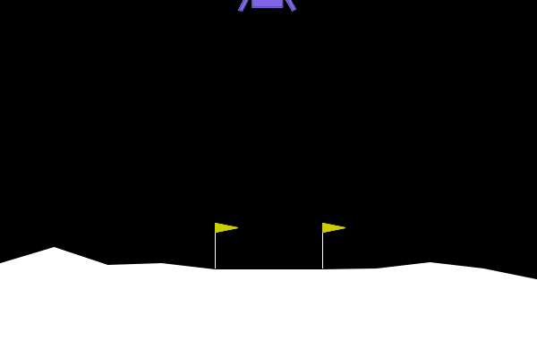

.. _td3_tutorial:

Lunar Lander with TD3
=====================

In this tutorial, we will be training and optimising the hyperparameters of a population of TD3 agents
to beat the Gymnasium continuous lunar lander environment. AgileRL is a deep reinforcement learning
library, focussed on improving the RL training process through evolutionary hyperparameter
optimisation (HPO), which has resulted in up to 10x faster HPO compared to other popular deep RL
libraries. Check out the AgileRL github `repository <https://github.com/AgileRL/AgileRL/>`__ for
more information about the library.

To complete the lunar lander environment, the agent must learn to fire the engine left, right, up,
or not at all to safely navigate the lander to the landing pad without crashing.

  Figure 1: Completed Lunar Lander environment using an AgileRL TD3 agent

TD3 Overview
------------

TD3 (twin-delayed deep deterministic policy gradient) is an off-policy actor-critic algorithm used
to estimate the optimal policy function, which determines what actions an agent should take given the
observed state of the environment. The agent does this by using a policy network (actor) to determine actions
given a particular state and then a value network (critic) to estimate the Q-value of the state-action pairs
determined by the policy network (actor). TD3 improves upon DDPG (deep deterministic policy gradient) to reduce
overestimation bias by doing the following:

* Using two Q networks (critics) and selecting the minimum Q-value
* Updating the policy network less frequently than the Q network
* Adding noise to actions used to estimate the target Q value

Dependencies
------------

.. code-block:: python

    # Author: Michael Pratt
    import os

    import imageio
    import gymnasium as gym
    import numpy as np
    import torch
    from tqdm import trange

    from agilerl.algorithms.td3 import TD3
    from agilerl.components.replay_buffer import ReplayBuffer
    from agilerl.hpo.mutation import Mutations
    from agilerl.hpo.tournament import TournamentSelection
    from agilerl.training.train_off_policy import train_off_policy
    from agilerl.utils.utils import (
        create_population,
        make_vect_envs,
        observation_space_channels_to_first
    )

Defining Hyperparameters
------------------------
Before we commence training, it's easiest to define all of our hyperparameters in one dictionary. Below is an example of
such for the TD3 algorithm. Additionally, we also define a mutations parameters dictionary, in which we determine what
mutations we want to happen, to what extent we want these mutations to occur, and what RL hyperparameters we want to tune.
Additionally, we also define our upper and lower limits for these hyperparameters to define search spaces.

.. code-block:: python

    # Initial hyperparameters
    INIT_HP = {
        "ALGO": "TD3",
        "POP_SIZE": 4,  # Population size
        "BATCH_SIZE": 128,  # Batch size
        "LR_ACTOR": 0.0001,  # Actor learning rate
        "LR_CRITIC": 0.001,  # Critic learning rate
        "O_U_NOISE": True,  # Ornstein-Uhlenbeck action noise
        "EXPL_NOISE": 0.1,  # Action noise scale
        "MEAN_NOISE": 0.0,  # Mean action noise
        "THETA": 0.15,  # Rate of mean reversion in OU noise
        "DT": 0.01,  # Timestep for OU noise
        "GAMMA": 0.99,  # Discount factor
        "MEMORY_SIZE": 100_000,  # Max memory buffer size
        "POLICY_FREQ": 2,  # Policy network update frequency
        "LEARN_STEP": 1,  # Learning frequency
        "TAU": 0.005,  # For soft update of target parameters
        # Swap image channels dimension from last to first [H, W, C] -> [C, H, W]
        "CHANNELS_LAST": False,  # Use with RGB states
        "EPISODES": 1000,  # Number of episodes to train for
        "EVO_EPOCHS": 20,  # Evolution frequency, i.e. evolve after every 20 episodes
        "TARGET_SCORE": 200.0,  # Target score that will beat the environment
        "EVO_LOOP": 3,  # Number of evaluation episodes
        "MAX_STEPS": 500,  # Maximum number of steps an agent takes in an environment
        "LEARNING_DELAY": 1000,  # Steps before starting learning
        "EVO_STEPS": 10000,  # Evolution frequency
        "EVAL_STEPS": None,  # Number of evaluation steps per episode
        "EVAL_LOOP": 1,  # Number of evaluation episodes
        "TOURN_SIZE": 2,  # Tournament size
        "ELITISM": True,  # Elitism in tournament selection
    }

    # Mutation parameters
    MUT_P = {
        # Mutation probabilities
        "NO_MUT": 0.4,  # No mutation
        "ARCH_MUT": 0.2,  # Architecture mutation
        "NEW_LAYER": 0.2,  # New layer mutation
        "PARAMS_MUT": 0.2,  # Network parameters mutation
        "ACT_MUT": 0.2,  # Activation layer mutation
        "RL_HP_MUT": 0.2,  # Learning HP mutation
        "MUT_SD": 0.1,  # Mutation strength
        "RAND_SEED": 42,  # Random seed
        # Define max and min limits for mutating RL hyperparams
        "MIN_LR": 0.0001,
        "MAX_LR": 0.01,
        "MIN_BATCH_SIZE": 8,
        "MAX_BATCH_SIZE": 1024,
        "MIN_LEARN_STEP": 1,
        "MAX_LEARN_STEP": 16,
    }

Create the Environment
----------------------
In this particular tutorial, we will be focussing on the continuous lunar lander environment as TD3 can only be
used with continuous action environments.

.. code-block:: python

    num_envs=8
    env = make_vect_envs("LunarLanderContinuous-v2", num_envs=num_envs)  # Create environment

    observation_space = env.single_observation_space
    action_space = env.single_action_space
    if INIT_HP["CHANNELS_LAST"]:
        # Adjust dimensions for PyTorch API (C, H, W), for envs with RGB image states
        observation_space = observation_space_channels_to_first(observation_space)

Create a Population of Agents
-----------------------------
To perform evolutionary HPO, we require a population of agents. Individuals in this population will share experiences but
learn individually, allowing us to determine the efficacy of certain hyperparameters. Individuals that learn best
are more likely to survive until the next generation, and so their hyperparameters are more likely to remain present in the
population. The sequence of evolution (tournament selection followed by mutation) is detailed further below.

.. code-block:: python

    # Set-up the device
    device = "cuda" if torch.cuda.is_available() else "cpu"

    # Define the network configuration of a simple mlp with two hidden layers, each with 64 nodes
    net_config = {"head_config": {"hidden_size": [64, 64]}}

    # Mutation config for RL hyperparameters
    hp_config = HyperparameterConfig(
        lr_actor = RLParameter(min=1e-4, max=1e-2),
        lr_critic = RLParameter(min=1e-4, max=1e-2),
        learn_step = RLParameter(min=1, max=16, dtype=int),
        batch_size = RLParameter(
            min=8, max=512, dtype=int
            )
    )

    # Define a population
    pop = create_population(
        algo="TD3", # Algorithm
        observation_space=observation_space,  # State dimension
        action_space=action_space,  # Action dimension
        net_config=net_config,  # Network configuration
        INIT_HP=INIT_HP,  # Initial hyperparameters
        hp_config=hp_config,  # RL hyperparameter configuration
        population_size=INIT_HP["POP_SIZE"],  # Population size
        num_envs=num_envs,
        device=device,
    )

Experience Replay
-----------------

In order to efficiently train a population of RL agents, off-policy algorithms are able to share memory within populations.
This reduces the exploration needed by an individual agent because it allows faster learning from the behaviour of other agents.
For example, if you were able to watch a bunch of people attempt to solve a maze, you could learn from their mistakes and successes
without necessarily having to explore the entire maze yourself.

The object used to store experiences collected by agents in the environment is called the Experience Replay Buffer, and is defined
by the class ``ReplayBuffer()``. During training it can be added to using the ``ReplayBuffer.save_to_memory()`` function, or
``ReplayBuffer.save_to_memory_vect_envs()`` for vectorized environments (recommended). To sample from the replay buffer, call ``ReplayBuffer.sample()``.

.. code-block:: python

    field_names = ["state", "action", "reward", "next_state", "terminated"]
    memory = ReplayBuffer(
        memory_size=10_000,  # Max replay buffer size
        field_names=field_names,  # Field names to store in memory
        device=device,
    )

Creating Mutations and Tournament objects
-----------------------------------------

Tournament selection is used to select the agents from a population which will make up the next generation of agents. If
elitism is used, the best agent from a population is automatically preserved and becomes a member of the next generation.
Then, for each tournament, k individuals are randomly chosen, and the agent with the best evaluation fitness is preserved.
This is repeated until the population for the next generation is full.

The class ``TournamentSelection()`` defines the functions required for tournament selection. ``TournamentSelection.select()``
returns the best agent, and the new generation of agents.

.. code-block:: python

    tournament = TournamentSelection(
        INIT_HP["TOURN_SIZE"],
        INIT_HP["ELITISM"],
        INIT_HP["POP_SIZE"],
        INIT_HP["EVAL_LOOP"],
    )

Mutation is periodically used to explore the hyperparameter space, allowing different hyperparameter combinations to be
trialled during training. If certain hyperparameters prove relatively beneficial to training, then that agent is more
likely to be preserved in the next generation, and so those characteristics are more likely to remain in the population.

The ``Mutations()`` class is used to mutate agents with pre-set probabilities. The available mutations currently implemented are:

* No mutation
* Network architecture mutation - adding layers or nodes. Trained weights are reused and new weights are initialized randomly.
* Network parameters mutation - mutating weights with Gaussian noise.
* Network activation layer mutation - change of activation layer.
* RL algorithm mutation - mutation of learning hyperparameter, such as learning rate or batch size.

``Mutations.mutation()`` returns a mutated population.
Tournament selection and mutation should be applied sequentially to fully evolve a population between evaluation and learning cycles.

.. code-block:: python

    mutations = Mutations(
        no_mutation=MUT_P["NO_MUT"],
        architecture=MUT_P["ARCH_MUT"],
        new_layer_prob=MUT_P["NEW_LAYER"],
        parameters=MUT_P["PARAMS_MUT"],
        activation=MUT_P["ACT_MUT"],
        rl_hp=MUT_P["RL_HP_MUT"],
        mutation_sd=MUT_P["MUT_SD"],
        rand_seed=MUT_P["RAND_SEED"],
        device=device,
    )

Training and Saving an Agent
----------------------------

Using AgileRL ``train_off_policy`` function
~~~~~~~~~~~~~~~~~~~~~~~~~~~~~~~~~~~~~~~~~~~

The simplest way to train an AgileRL agent is to use one of the implemented AgileRL train functions.
Given that TD3 is an off-policy algorithm, we can make use of the ``train_off_policy`` function. This
training function will orchestrate the training and hyperparameter optimisation process, removing the
the need to implement a custom training loop. It will return a trained population, as well as the associated
fitnesses (fitness is each agents test scores on the environment).

.. code-block:: python

    trained_pop, pop_fitnesses = train_off_policy(
        env=env,
        env_name="LunarLanderContinuous-v2",
        algo="TD3",
        pop=pop,
        memory=memory,
        INIT_HP=INIT_HP,
        MUT_P=MUT_P,
        swap_channels=INIT_HP["CHANNELS_LAST"],
        max_steps=INIT_HP["MAX_STEPS"],
        evo_steps=INIT_HP["EVO_STEPS"],
        eval_steps=INIT_HP["EVAL_STEPS"],
        eval_loop=INIT_HP["EVAL_LOOP"],
        learning_delay=INIT_HP["LEARNING_DELAY"],
        target=INIT_HP["TARGET_SCORE"],
        tournament=tournament,
        mutation=mutations,
        wb=False,  # Boolean flag to record run with Weights & Biases
        save_elite=True,  # Boolean flag to save the elite agent in the population
        elite_path="TD3_trained_agent.pt",
    )

.. note::

   Known `Gymnasium issue <https://github.com/Farama-Foundation/Gymnasium/issues/722>`_ - running vectorize environments as top-level code (without ``if __name__ == "__main__":``) may cause multiprocessing errors. To fix, run the above as a method under ``main``, e.g.

   .. code-block:: python

      def train_agent():
          # ... training code

      if __name__ == "__main__":
          train_agent()

Using a custom training loop
~~~~~~~~~~~~~~~~~~~~~~~~~~~~
If we wanted to have more control over the training process, it is also possible to write our own custom
training loops to train our agents. The training loop below can be used alternatively to the above ``train_off_policy``
function and is an example of how we might choose to make use of a population of AgileRL agents in our own training loop.

.. code-block:: python

    total_steps = 0

    # TRAINING LOOP
    print("Training...")
    pbar = trange(INIT_HP["MAX_STEPS"], unit="step")
    while np.less([agent.steps[-1] for agent in pop], INIT_HP["MAX_STEPS"]).all():
        pop_episode_scores = []
        for agent in pop:  # Loop through population
            state, info = env.reset()  # Reset environment at start of episode
            scores = np.zeros(num_envs)
            completed_episode_scores = []
            steps = 0

            for idx_step in range(INIT_HP["EVO_STEPS"] // num_envs):
                if INIT_HP["CHANNELS_LAST"]:
                    state = obs_channels_to_first(state)

                action = agent.get_action(state)  # Get next action from agent

                # Act in environment
                next_state, reward, terminated, truncated, info = env.step(action)
                scores += np.array(reward)
                steps += num_envs
                total_steps += num_envs

                # Collect scores for completed episodes
                reset_noise_indices = []
                for idx, (d, t) in enumerate(zip(terminated, truncated)):
                    if d or t:
                        completed_episode_scores.append(scores[idx])
                        agent.scores.append(scores[idx])
                        scores[idx] = 0
                        reset_noise_indices.append(idx)
                agent.reset_action_noise(reset_noise_indices)

                # Save experience to replay buffer
                if INIT_HP["CHANNELS_LAST"]:
                    memory.save_to_memory(
                        state,
                        action,
                        reward,
                        obs_channels_to_first(next_state),
                        terminated,
                        is_vectorised=True,
                    )
                else:
                    memory.save_to_memory(
                        state,
                        action,
                        reward,
                        next_state,
                        terminated,
                        is_vectorised=True,
                    )

                # Learn according to learning frequency
                if memory.counter > INIT_HP["LEARNING_DELAY"] and len(memory) >= agent.batch_size:
                    for _ in range(num_envs // agent.learn_step):
                        # Sample replay buffer
                        experiences = memory.sample(agent.batch_size)
                        # Learn according to agent's RL algorithm
                        agent.learn(experiences)

                state = next_state

            pbar.update(INIT_HP["EVO_STEPS"] // len(pop))
            agent.steps[-1] += steps
            pop_episode_scores.append(completed_episode_scores)

        # Evaluate population
        fitnesses = [
            agent.test(
                env,
                swap_channels=INIT_HP["CHANNELS_LAST"],
                INIT_HP["MAX_STEPS"]=INIT_HP["EVAL_STEPS"],
                loop=INIT_HP["EVAL_LOOP"],
            )
            for agent in pop
        ]
        mean_scores = [
            (
                np.mean(episode_scores)
                if len(episode_scores) > 0
                else "0 completed episodes"
            )
            for episode_scores in pop_episode_scores
        ]

        print(f"--- Global steps {total_steps} ---")
        print(f"Steps {[agent.steps[-1] for agent in pop]}")
        print(f"Scores: {mean_scores}")
        print(f'Fitnesses: {["%.2f"%fitness for fitness in fitnesses]}')
        print(
            f'5 fitness avgs: {["%.2f"%np.mean(agent.fitness[-5:]) for agent in pop]}'
        )

        # Tournament selection and population mutation
        elite, pop = tournament.select(pop)
        pop = mutations.mutation(pop)

        # Update step counter
        for agent in pop:
            agent.steps.append(agent.steps[-1])

    # Save the trained algorithm
    save_path = "TD3_trained_agent.pt"
    elite.save_checkpoint(save_path)

    pbar.close()
    env.close()

Loading an Agent for Inference and Rendering your Solved Environment
--------------------------------------------------------------------
Once we have trained and saved an agent, we may want to then use our trained agent for inference. Below outlines
how we would load a saved agent and how it can then be used in a testing loop.

Load agent
~~~~~~~~~~
.. code-block:: python

    td3 = TD3.load_checkpoint(save_path, device=device)

Test loop for inference
~~~~~~~~~~~~~~~~~~~~~~~
.. code-block:: python

    test_env = gym.make("LunarLanderContinuous-v2", render_mode="rgb_array")
    rewards = []
    frames = []
    testing_eps = 7
    max_testing_steps = 1000
    with torch.no_grad():
        for ep in range(testing_eps):
            state = test_env.reset()[0]  # Reset environment at start of episode
            score = 0

            for step in range(max_testing_steps):
                # If your state is an RGB image
                if INIT_HP["CHANNELS_LAST"]:
                    state = obs_channels_to_first(state)

                # Get next action from agent
                action, *_ = td3.get_action(state, training=False)

                # Save the frame for this step and append to frames list
                frame = test_env.render()
                frames.append(frame)

                # Take the action in the environment
                state, reward, terminated, truncated, _ = test_env.step(action)

                # Collect the score
                score += reward

                # Break if environment 0 is done or truncated
                if terminated or truncated:
                    print("terminated")
                    break

            # Collect and print episodic reward
            rewards.append(score)
            print("-" * 15, f"Episode: {ep}", "-" * 15)
            print("Episodic Reward: ", rewards[-1])

        print(rewards)

        test_env.close()

Save test episosdes as a gif
~~~~~~~~~~~~~~~~~~~~~~~~~~~~
.. code-block:: python

    frames = frames[::3]
    gif_path = "./videos/"
    os.makedirs(gif_path, exist_ok=True)
    imageio.mimwrite(
        os.path.join("./videos/", "td3_lunar_lander.gif"), frames, duration=50, loop=0
    )
    mean_fitness = np.mean(rewards)
