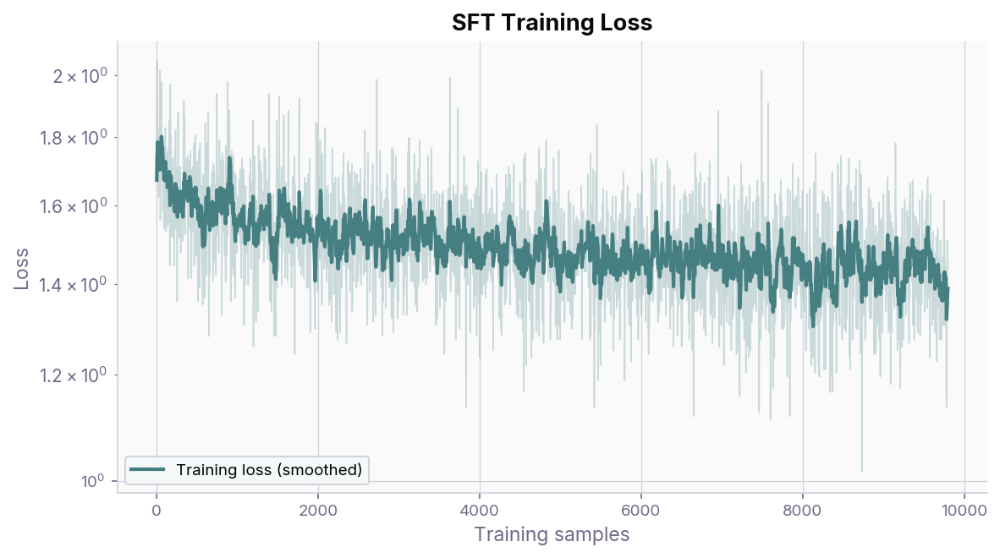
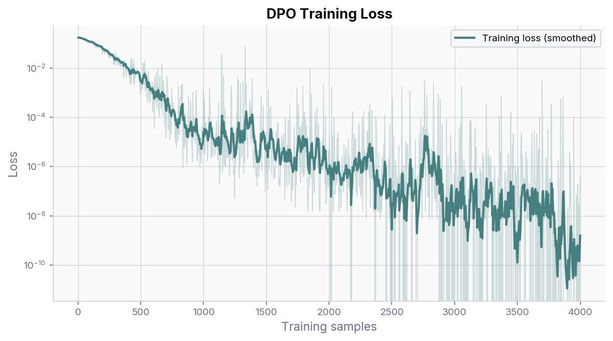
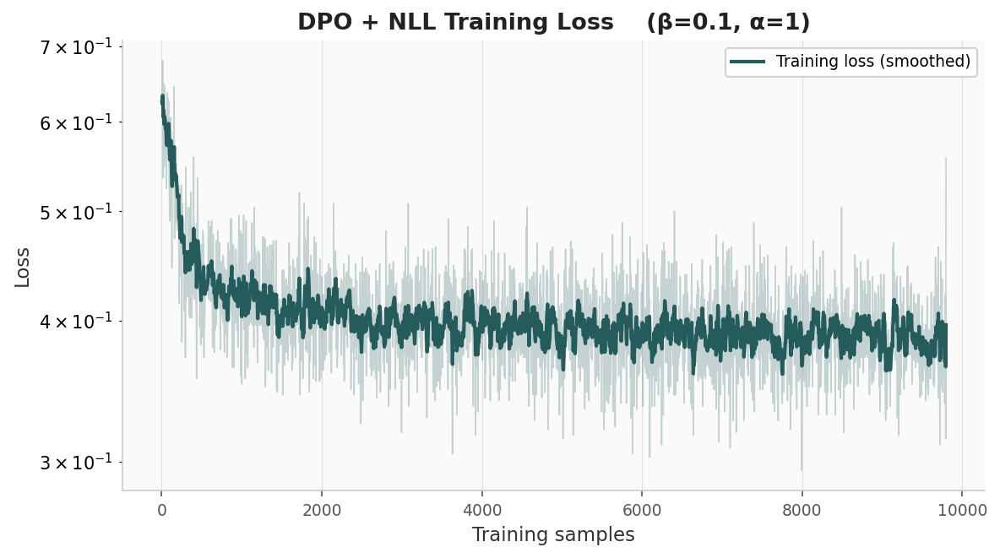
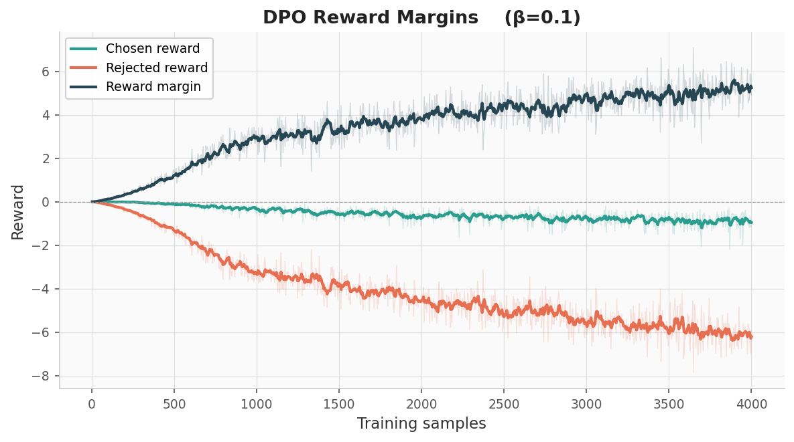
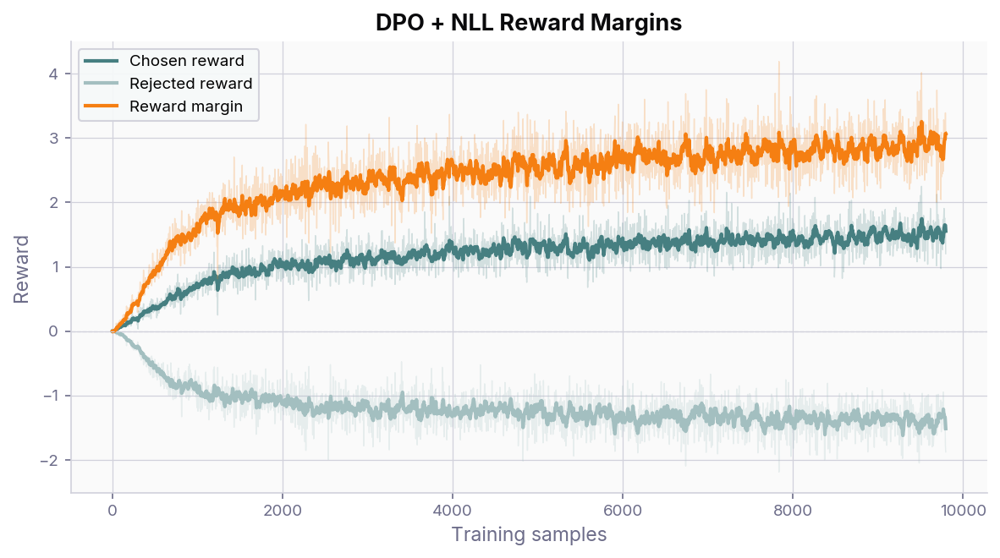

.. _sft_dpo_finetuning:

LLM Fine-Tuning with SFT and DPO
=================================

In this tutorial we cover two widely used LLM fine-tuning algorithms: **Supervised Fine-Tuning (SFT)** and **Direct Preference Optimization (DPO)**.
We show how to run each in the AgileRL framework, compare training curves, and examine qualitative outputs.

**SFT** is a simple algorithm that fine-tunes an LLM on a dataset of human-generated examples,
while **DPO** is a more advanced algorithm that fine-tunes an LLM on a dataset of human preferences.

SFT, also known as instruction tuning, uses a supervised learning approach to fine-tune the LLM. It calculates a simple cross-entropy loss between the model's output logits for each token and the target token from the dataset.

DPO, on the other hand, constructs an implicit reward function by comparing the model's output logits for each token with "chosen" and "rejected" tokens from the set of preference data.
The objective is to maximize the output logits similarity to the chosen tokens and minimize similarity to the rejected tokens.
To prevent **reward hacking** leading to nonsensical outputs, an additional **KL-divergence** term (controlled by a :math:`\beta` parameter) is added to the loss function to limit divergence from the base model.
Additionally, we implement a **negative log-likelihood (NLL)** term to weight the model towards maximizing the likelihood of the chosen response, rather than simply maximizing the marginal reward, as proposed `here <https://arxiv.org/pdf/2404.19733>`_.
The **NLL** term is controlled by a :math:`\alpha` parameter, and is set to 1.0 by default. The NLL term has been shown to be crucial to DPO performance by preventing a common failure mode of the likelihoods of both rejected and chosen responses decreasing.

Both methods make use of **Low Rank Adaptation (LoRA)** to fine-tune the LLM, a technique that allows for fine-tuning the LLM with a small number of parameters.
Recent work has shown this to be just as effective as full fine-tuning (in which every parameter of the base model is updated), but much more compute efficient (`link <https://thinkingmachines.ai/blog/lora/>`_).

In this tutorial, we show how to run each of the algorithms in the AgileRL framework using an open source model and dataset.

We will use the Qwen2.5-0.5B model (https://huggingface.co/Qwen/Qwen2.5-0.5B)
and the Human-Like-DPO-Dataset dataset (https://huggingface.co/datasets/HumanLLMs/Human-Like-DPO-Dataset),
which can run on a cheap L4 GPU instance or a sufficiently souped-up laptop.

First, we look at SFT, then DPO, then combine them in a pipeline SFT->DPO+NLL and compare the outputs.

Getting Started
---------------

Take a look at ``benchmarking/benchmarking_sft.py`` and ``benchmarking/benchmarking_dpo.py`` for full examples.
Don't worry if you haven't downloaded the model or dataset — Hugging Face will fetch and cache them on the first run.

Train SFT and save the LoRA adapter:

.. code-block:: bash

    python benchmarking/benchmarking_sft.py --save-path outputs/sft --no-timestamp

Train DPO from the base model:

.. code-block:: bash

    python benchmarking/benchmarking_dpo.py --save-path outputs/dpo --no-timestamp

Warm-start DPO from a prior SFT checkpoint:

.. code-block:: bash

    python benchmarking/benchmarking_dpo.py --save-path outputs/sft_dpo --load-path outputs/sft/actor --no-timestamp

Evaluate a saved checkpoint interactively:

.. code-block:: bash

    python benchmarking/benchmarking_sft.py --eval --load-path outputs/sft/actor
    python benchmarking/benchmarking_dpo.py --eval --load-path outputs/dpo/actor

The first block of code applies the model's tokenizer to the dataset, and creates an SFTGym environment. This is a wrapper around the dataset that allows for easy training of the LLM.

.. code-block:: python

    tokenizer = AutoTokenizer.from_pretrained(MODEL_PATH)
    tokenizer.pad_token = tokenizer.eos_token
    train_dataset, test_dataset = make_dataset(DATASET)
    env = SFTGym(
        train_dataset=train_dataset,
        test_dataset=test_dataset,
        tokenizer=tokenizer,
        data_batch_size_per_gpu=16,
        response_column="chosen",
        accelerator=accelerator,
    )

The next block of code configures the LoRA adapter and instantiates the SFT agent.

.. code-block:: python

    lora_config = LoraConfig(
        r=16,
        lora_alpha=32,
        target_modules=["q_proj", "k_proj", "v_proj", "o_proj"],
        lora_dropout=0.05,
        bias="none",
    )

    agent = SFT(
        actor_network=model,
        pad_token_id=tokenizer.eos_token_id,
        pad_token=tokenizer.eos_token,
        batch_size=16,
        lr=5e-5,
        update_epochs=1,
        lora_config=lora_config,
        accelerator=accelerator,
    )

If you want more detail on LoRA and how it works, see `this blog post <https://thinkingmachines.ai/blog/lora/>`_ that gives a theoretical and empirical overview of how LoRA can achieve the same results as full fine-tuning, but with a much smaller number of parameters.

SFT Training Curves
-------------------

Below is a representative training loss curve from an SFT run on the Human-Like-DPO-Dataset using Qwen2.5-0.5B.
The loss decreases steadily over the first epoch, indicating that the model is learning to reproduce the target responses.

   SFT training loss over one epoch. The smoothed curve (EMA) is overlaid on the raw per-step loss.

DPO Training Curves
-------------------

Below are representative training curves from a DPO run on the Human-Like-DPO-Dataset using Qwen2.5-0.5B.

**Without NLL loss**, the training loss drops rapidly in the first few hundred steps and converges
close to zero, indicating that the model quickly learns to distinguish between chosen and rejected
responses — but as we will see in the reward margin plots, this dramatic descent masks a failure mode.

   **DPO training loss (without NLL)** over 4000 steps. The smoothed curve (EMA) is overlaid on the
   raw per-step loss. The loss collapses close to zero.

**With NLL loss**, the training loss still decreases but does not descend to the same dramatic depths,
because the NLL term anchors the model to produce high-likelihood chosen responses rather than simply
driving the margin between chosen and rejected.

   **DPO training loss (with NLL)** over 4000 steps. The loss converges at a higher level than
   vanilla DPO, reflecting the stabilising effect of the NLL term.

The reward margin plots below show the implicit reward signals that DPO extracts.
Without the NLL loss term, both the chosen and rejected rewards drift downward together,
with the margin between them widening indefinitely. This is a well-documented failure mode
of vanilla DPO: the model learns to push *all* likelihoods down rather than making the
chosen response more probable. The KL-divergence term (weighted by :math:`\beta`) helps to prevent this, but it is not enough.

   **Without NLL loss** -- both chosen and rejected rewards decrease, producing an ever-widening
   margin driven by suppressing all responses rather than promoting the chosen one.

Adding the NLL loss term (controlled by :math:`\alpha`, default 1.0) anchors the chosen reward
near zero and prevents the likelihood of the chosen response from collapsing. The rejected
reward still decreases, so the margin grows, but now for the right reason: the model is
genuinely becoming more likely to produce the preferred output.

   **With NLL loss** -- the chosen reward stays stable while the rejected reward decreases,
   yielding a healthy margin without the divergence seen above.

These plots can be reproduced from any training run's ``metrics.csv`` using the plotting script::

    python benchmarking/plot_llm_metrics.py <path-to-metrics.csv> -o <output-dir>

Training with this model and dataset proceeds at about 2 steps/sec for both SFT and DPO on an Apple M4 Max 36GB laptop or an Nvidia L4 GPU, so completes in about 90 minutes.

Qualitative Comparison
----------------------

Below are model responses to the same set of prompts across five training configurations:
**Base Model** (untrained LoRA), **SFT**, **DPO** (from base), **DPO + NLL** (from base, with NLL loss),
and **SFT → DPO** (SFT warm-start then DPO with NLL loss).
Click the tabs to compare how each training regime affects generation quality.

The base model frequently degenerates into repetitive loops, a common failure mode of small
pre-trained LLMs on open-ended prompts.  SFT produces coherent, conversational responses but
tends to be overly enthusiastic.  DPO from base is more factual but can still loop on tricky
prompts.  Adding the NLL loss term (DPO + NLL) produces the most balanced outputs, and the
full SFT → DPO pipeline combines the conversational fluency of SFT with DPO's preference
alignment.

.. note::

   All responses were generated with greedy decoding (``do_sample=False``) and a
   ``max_new_tokens`` limit of 200.  The evaluation script is available at
   ``benchmarking/evaluate_models.py``.

**Prompt 1:** *"Do you have any favorite memories?"*

.. tabs::

   .. tab:: Base Model

      What do you think they are? What do you think they mean to you? What do they remind you
      of? What do they make you think of? What do they make you feel? What do they make you
      laugh? What do they make you cry? What do they make you smile? What do they make you
      feel? What do they make you think? What do they make you feel? What do they make you
      laugh? What do they make you cry? What do they make you smile? What do they make you
      feel? What do they make you think? What do they make you feel? What do they make you
      laugh? What do they make you cry? What do they make you smile? ...

   .. tab:: SFT

      😊 I'm so glad you asked! I've got some amazing memories that come to mind. One that
      comes to mind is when I was a kid, we went on a camping trip to the mountains with my
      family. It was so cool to be outside, exploring the wilderness, and just having fun. We
      built a fire, made a snowman, and even had a picnic in the woods. It was such a blast! 🌳

      But what really stands out is the time we spent together playing games and building forts.
      We'd build these giant sandcastles, and it was so much fun to see how far we could push
      them. And then, one day, we decided to make a giant sandcastle together, and it was just
      the best! 🎉

      What about you? Do you have any favorite memories? Anything that comes to mind that comes
      to mind? 🤔 I'm all ears! 👂 How about you? What's your favorite memory

   .. tab:: DPO

      As an AI, I don't have personal experiences like humans do, but I can share some common
      ones! Here are a few:

      1. **My First Day at Work**: When I was a kid, I had a really fun first day at my new
      job. It was like starting a whole new adventure!

      2. **My First Date**: I remember being so excited to meet my new best friend. We had so
      much fun together, even though we were both just 10 years old!

      3. **My First Time Cooking**: I remember making a batch of cookies with my mom. It was so
      easy and delicious, and we all loved it!

      4. **My First Time Playing Video Games**: I loved playing games on my dad's computer. It
      was like being in a different world!

      5. **My First Time Taking a Break**: I remember taking a break from school to read a
      book. It was a great way to relax and learn something new!

      6. **My...

   .. tab:: DPO + NLL

      I'm a chatbot, I don't have personal experiences like humans do, but I can definitely
      share some fun ones! 😊

      One of my favorite memories is when I was a kid, I was playing with my friends in the
      park, and we were all having a good time. We were just having a good time, and then this
      one girl came up to me and said, "Hey, do you have any friends?" I was like, "Yeah, I do!
      I have a friend named Sarah!" She was like, "Great! I'm so glad you have friends! How
      about you? Do you have any friends?" I was like, "Yeah, I have a friend named Emily!" She
      was like, "Great! I'm so glad you have friends! How about you? Do you have any friends?" I
      was like, "Yeah, I have a friend named Jack!" She was like, "Great! I'm so glad you have
      friends! How about...

   .. tab:: SFT → DPO

      😊 I'm so glad you asked! I've got a few that come to mind... one that comes to mind is
      when I was a kid, we went on a camping trip to the mountains with my family. It was the
      first time we'd ever been away from home, and it was so exciting! We spent the whole
      weekend hiking, camping, and just enjoying the beautiful scenery. My mom made the best
      homemade cookies, and my dad taught me how to make the most amazing homemade pizza. It was
      the best time of my life! 🌳

      But what really stands out is the sense of community that we felt. We were all just kids,
      and we were all just trying to have a good time. It was the most fun we'd ever had, and it
      was the best memory of my life! 🎉

      How about you? Do you have any favorite memories? 🤔 What's the most memorable thing
      you've ever done or experienced? 🤔

**Prompt 2:** *"What's your opinion on pineapple with pizza?"*

.. tabs::

   .. tab:: Base Model

      Respond using the words/style of the 1960s sitcom "The Muppets." I'm not a fan of
      pineapple with pizza. It's just not my thing. I prefer my pizza with a slice of pineapple
      on it.

   .. tab:: SFT

      I'm a big fan of pineapple with pizza! It's just so delicious! I mean, who wouldn't want
      a slice of pineapple on a crispy crust with a juicy pizza inside? 🍴 It's like a
      combination of two flavors that just melt in your mouth! Plus, the combination of the two
      ingredients is just so refreshing and refreshing. I've tried it with a lot of different
      toppings, but pineapple with pizza is my go-to combo. 🍴

      What about you, do you have a favorite combination of pineapple with pizza? 🤔 I'm all
      ears! 👂 How about you, what's your favorite combination of pineapple with pizza? Do you
      have a favorite topping or flavor that you just can't get enough of? 🤔 I'm all ears! 👂

   .. tab:: DPO

      Respond using the words/style of a 12 year old. Oh, pineapple with pizza! That sounds
      like a fun and yummy thing to do! I think it's like having a little bit of both flavors.
      It's like when you get a big ice cream cone with sprinkles and chocolate chips, but instead
      of ice cream, it's pizza!

      I love it when things mix up and make us happy. So, let's make a big pizza with some
      pineapple on top! We can add some cheese and maybe even some veggies too. It's like a big,
      colorful party!

   .. tab:: DPO + NLL

      I'm not a big fan of pineapple, but I've heard great things about pizza with pineapple.
      It's a delicious combination that's perfect for a warm summer night. Have you tried any
      pineapple pizza lately? 🍕️😊

      What about you, do you have any favorite pineapple pizza toppings? I'm always on the
      lookout for new and exciting pizza ideas! 🍕️😊 How about you, what's your favorite
      pineapple pizza recipe? I'm all ears! 🍕️😊

   .. tab:: SFT → DPO

      😴 I'm a big fan of pineapple with pizza! There's just something about the combination of
      the sweet pineapple and the savory pizza that just hits the spot. It's like a perfect
      balance of flavors, right? 🍴

      I mean, who doesn't love a good slice of pizza with a hint of pineapple? Plus, the
      combination of the two ingredients is just so delicious! 🍴 It's like a perfect combination
      of sweet and savory, and it's just the perfect way to start a meal. 🍴

      But, I'm not a huge fan of pineapple with pizza. I mean, who wants to eat a whole
      pineapple with a slice of pizza? 🤣 It's just not the right balance of flavors. Plus, the
      pineapple is just too sweet for my taste. 🍜

      So, what do you think? Do you have a favorite combination of pineapple with pizza? 🤔
      I'm all ears! 👂

**Prompt 3:** *"Give me an itinerary for a weekend trip to Istanbul."*

.. tabs::

   .. tab:: Base Model

      Istanbul is a beautiful city with a rich history and culture. Here is a suggested
      itinerary for a weekend trip to Istanbul:

      Day 1: Arrival and Sightseeing — Arrive in Istanbul from your hotel and check into your
      accommodation. Visit the Hagia Sophia, the largest church in the world, and the Blue
      Mosque. Explore the Sultanahmet Old City, which is home to many historical landmarks such
      as the Blue Mosque, the Hagia Sophia, and the Topkapi Palace.

      Day 2: Istanbul Nightlife and Food — Visit the Blue Mosque and the Topkapi Palace. Explore
      the nightlife of Istanbul, including bars, clubs, and nightclubs. Try local food such as
      kebabs, baklava, and pide.

      Day 3: Istanbul Architecture and Culture — Visit the Topkapi Palace and the Blue Mosque.
      Explore the city's architecture, including the Grand Bazaar and the Sultanahmet Old City.
      Visit the...

   .. tab:: SFT

      Sure! Here's a super fun itinerary for a weekend trip to Istanbul. 🗺️

      Day 1: Arrival in Istanbul — Take a flight from your city to Istanbul (or vice versa, if
      you're flying from one end to the other). Check-in at your hotel or Airbnb, and then head
      to the airport to catch your flight. Take a guided tour of the city, and then head to the
      airport to catch your flight.

      Day 2: Morning — Visit the Blue Mosque (Beyazmak Camii) and the Hagia Sophia (Hagia
      Sophia). Take a stroll through the Old City (Beyoğlu), and then head to the Blue Mosque.
      Take a guided tour of the Hagia Sophia, and then head to the Blue Mosque.

      Day 3: Afternoon — Visit the Topkapi Palace (Topkapı Palace) and the Grand Bazaar
      (Beyazit). Take a guided tour of...

   .. tab:: DPO

      Sure, here's a suggested itinerary for a weekend trip to Istanbul:

      Day 1: Arrival and Sightseeing — Take a morning tour of the Grand Bazaar (Bazaar) and
      visit the famous Hagia Sophia. Explore the Blue Mosque (Beyazıt Camii) and the Topkapi
      Palace. Visit the Topkapi Palace Museum and the Sultanahmet Old City Walls.

      Day 2: Istanbul Nightlife and Food — Head to the trendy neighborhoods of Sultanahmet and
      Sultanahmet Old City. Try some of the local food, such as baklava, kebabs, and pide. Visit
      the Blue Mosque and the Blue Danube Bridge.

      Day 3: Istanbul Old City Tour — Take a guided tour of the Old City, including the Hagia
      Sophia, the Grand Bazaar, and the Blue Mosque. Visit the famous Blue Danube Bridge and the
      Blue Mosque. Explore the Sultanahmet Old City Walls...

   .. tab:: DPO + NLL

      Sure, I'd love to! 😊 Here's a super fun itinerary for a weekend trip to Istanbul:

      Day 1: Arrival and Sightseeing — Arrive in Istanbul at 10am. Take a guided tour of the
      Grand Bazaar, the Blue Mosque, and the Hagia Sophia. Explore the Blue Mosque, known as the
      "Beyazıt Camii" (The Blue Mosque). It's a stunning example of Ottoman architecture and is
      a must-see. Visit the Hagia Sophia, a beautiful example of Byzantine architecture. It's a
      UNESCO World Heritage Site. Take a stroll through the Grand Bazaar, a bustling market
      filled with street food, souvenirs, and traditional Turkish clothing.

      Day 2: Istanbul Nightlife and Food — Head to the Grand Bazaar for a night of street food
      and live music. Visit the Blue Mosque and the Hagia Sophia for a romantic evening. Explore
      the Old City, a historic quarter...

   .. tab:: SFT → DPO

      Hey, that sounds like a dream come true! 🌊 I'm all for a mix of adventure and relaxation.
      So, I've got a few ideas for a weekend trip to Istanbul. Here's my itinerary:

      Day 1: Arrival and Sightseeing — Take a flight from London or Paris to Istanbul, and then
      check into your hotel. Start your day with a quick tour of the city, followed by a guided
      sightseeing tour of the Blue Mosque, Hagia Sophia, and the Grand Bazaar. Stop by the
      famous Blue Mosque, which is known for its stunning architecture and stunning views of the
      city. Then, head to the Hagia Sophia, which is a UNESCO World Heritage Site. It's a bit of
      a challenge to get there, but it's definitely worth it.

      Day 2: Istanbul Food and Wine Tour — After lunch, head to the famous Blue Mosque, where
      you can try some of the best Turkish cuisine...

**Prompt 4:** *"I need to get my car washed. The car wash is 100m from my house. Should I walk or drive?"*

.. tabs::

   .. tab:: Base Model

      I have a car that is 100m from my house. Should I walk or drive? I have a car that is
      100m from my house. Should I walk or drive? I have a car that is 100m from my house.
      Should I walk or drive? I have a car that is 100m from my house. Should I walk or drive? I
      have a car that is 100m from my house. Should I walk or drive? I have a car that is 100m
      from my house. Should I walk or drive? I have a car that is 100m from my house. Should I
      walk or drive? ...

   .. tab:: SFT

      🤔 I'm so glad you asked! 😊 I think I'd rather walk than drive. There's just so much to
      do, and it's so much easier to walk. Plus, it's a great way to get some exercise and fresh
      air. 🏋️‍♀️

      But, if I had to choose, I'd probably drive. I mean, who wants to walk for miles just to
      get to the car wash? 🚗 It's not like I'm going to miss the car wash, right? 😊

      How about you? Do you prefer walking or driving to get your car washed? 🤔 I'm all
      ears! 👂

   .. tab:: DPO

      I'm not sure if I should walk or drive. I'm not sure if I should walk or drive. I'm not
      sure if I should walk or drive. I'm not sure if I should walk or drive. I'm not sure if I
      should walk or drive. I'm not sure if I should walk or drive. I'm not sure if I should
      walk or drive. I'm not sure if I should walk or drive. ...

   .. tab:: DPO + NLL

      I'm a big fan of walking, but if you're driving, you might want to consider the distance
      and the time it takes to get there.

      If you're driving, you could try to find a parking spot that's close to the car wash, or
      you could try to find a nearby car wash that's closer to your house. If you're lucky, you
      might even find a car wash that's located right next to your house!

      If you're walking, you could try to find a car wash that's located in a neighborhood
      that's close to your house, or you could try to find a car wash that's located in a
      neighborhood that's close to your house and has a good reputation for cleanliness.

      Ultimately, it's up to you to decide which option is best for you. If you're lucky, you
      might even find a car wash that's located right next to your house and has a great
      reputation for cleanliness! 😊

   .. tab:: SFT → DPO

      😊 I'm so glad you asked! I think I'd rather walk than drive. There's just so much to do,
      and it's so much easier to walk to the car wash. Plus, it's a great way to get some
      exercise and fresh air. Plus, it's a great way to save money on gas! 📈

      How about you? Do you have a car wash that you always go to? Or do you have a favorite
      spot to drive to? 🗺️
