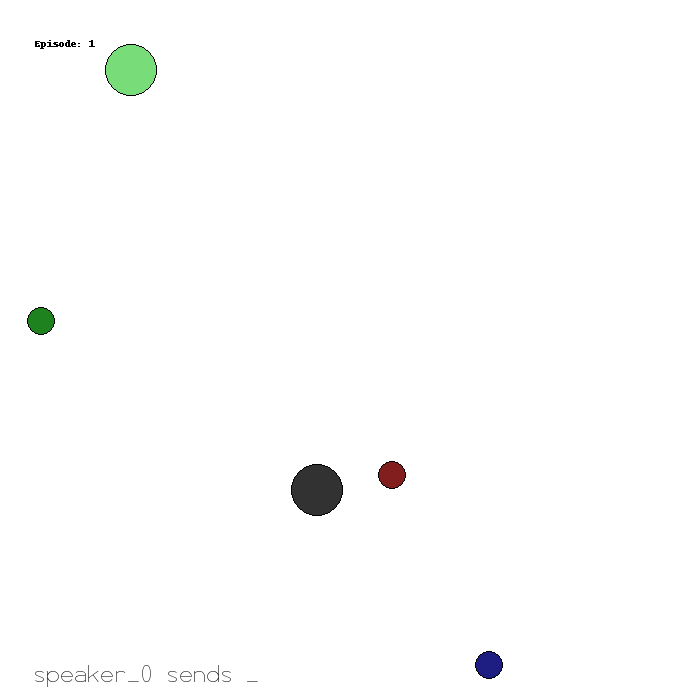

AgileRL PettingZoo Multi-agent Tutorials
====

These tutorials provide an introductory guide to using `AgileRL <https://github.com/AgileRL/AgileRL>`_ with `PettingZoo <https://pettingzoo.farama.org/>`_. AgileRL's multi-agent algorithms make use of the PettingZoo parallel API and allow users to train multiple-agents in parallel in both competitive and co-operative environments. This tutorial includes the following:

* :ref:`DQN<DQN tutorial>`: *Train a DQN agent to play Connect Four through curriculum learning and self-play*
* :ref:`MADDPG<MADDPG tutorial>`: *Train an MADDPG agent to play multi-agent atari games*
* :ref:`MATD3<MATD3 tutorial>`: *Train an MATD3 agent to play multi-particle-environment games*

AgileRL Overview
^^^^^

AgileRL is a deep reinforcement learning framework focused on streamlining training for reinforcement learning models. Using :ref:`evolutionary hyper-parameter optimisation<hpo>` (HPO), AgileRL allows users to train models significantly faster and more accurately when compared with traditional HPO techniques. AgileRL's multi-agent algorithms orchestrate the training of multiple agents at the same time, and benchmarking has shown up to 4x increase in return in a shorter time-frame when compared with implementations of the very same algorithms in other reinforcement learning libraries.

Examples using PettingZoo
^^^^^

* :ref:`MADDPG for co-operation: simple speaker listener environment<multiagenttraining>`

   Fig1: Performance of trained MADDPG algorithm on 6 random episodes

.. toctree::
   :maxdepth: 2

   dqn
   maddpg
   matd3
