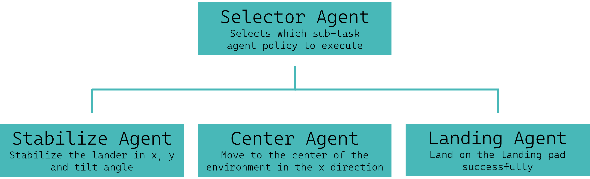

.. _skills_tutorials:

Hierarchical Skills Tutorial
============================

This tutorial provides an introductory guide to using `AgileRL <https://github.com/AgileRL/AgileRL>`_ to learn skills and apply these in a hierarchical fashion.
AgileRL's single-agent algorithms allow users to train agents to perform specific skills, and then combine these in a learned order to achieve an outcome.

Hierarchical reinforcement learning can be used to learn to complete tasks efficiently by breaking down problems into smaller sub-tasks or 'skills'.
For example, to train a robot hand to create a stack of blocks from scratch is very difficult - but by breaking this down into stages such as moving fingers, grasping a block,
lifting the block and building a tower, we can guide agents to perform the overall task. We can also then allow an agent to learn which order to perform these tasks in to achieve the overall goal.

.. list-table::

   * - .. figure:: LunarLander-v2_stabilize.gif

          Stabilize skill

     - .. figure:: LunarLander-v2_center.gif

          Center skill

   * - .. figure:: LunarLander-v2_landing.gif

          Landing skill

     - .. figure:: LunarLander-v2_selector.gif

          Selector - combining skills

This tutorial uses hierarchical reinforcement learning to train agents to solve the `LunarLander <https://gymnasium.farama.org/environments/box2d/lunar_lander/>`_ Gymnasium environment. The overall
task is broken down into three skills which are each trained separately:

* Stabilize the lander, minimizing movement in all directions
* Move to the center of the environment in the x-direction
* Land on the landing pad

A selector agent is also trained to select which skill to execute.

   Fig1: Hierarchical structure of LunarLander agents

Code
----

The following code should run without any issues. The comments are designed to help you understand how to use PettingZoo with AgileRL. If you have any questions, please feel free to ask in the `Discord server <https://discord.com/invite/eB8HyTA2ux>`_.

Imports
^^^^^^^

Importing the following packages, functions and classes will enable us to run the tutorial.

.. collapse:: Imports
   :open:

   .. code-block:: python

      import os
      from datetime import datetime

      import numpy as np
      import torch
      import wandb
      from tqdm import trange

      from agilerl.algorithms.ppo import PPO
      from agilerl.training.train_on_policy import train_on_policy
      from agilerl.utils.utils import create_population, make_skill_vect_envs, make_vect_envs
      from agilerl.wrappers.learning import Skill

Defining skills
^^^^^^^^^^^^^^^

To define the skills to be learned by our agent, we modify the reward from our environment. This is a form of :ref:`curriculum learning<DQN tutorial>`.
For example, if we want the agent to learn the skill of moving to the center of the environment in the x-direction, then we can introduce a negative reward scaled by the distance from the lander to the center.

To define these skills, we can use the AgileRL ``Skill`` class, which acts as a wrapper around the environment. Just the ``skill_reward`` method needs to be overwritten in order to encourage our agent to learn what we want.
This method takes the inputs and returns the outputs ``observation``, ``reward``, ``terminated``, ``truncated``, ``info``. We can also define variables in the class constructor. In this tutorial, for the LunarLander environment,
we define three skills: ``StabilizeSkill``, ``CenterSkill`` and ``LandingSkill``.

.. collapse:: Stabilize
   :open:

   .. code-block:: python

      class StabilizeSkill(Skill):
         def __init__(self, env):
            super().__init__(env)

            self.theta_level = 0
            self.history = {"x": [], "y": [], "theta": []}

         def skill_reward(self, observation, reward, terminated, truncated, info):
            if terminated or truncated:
                  reward = -100.0
                  self.history = {"x": [], "y": [], "theta": []}
                  return observation, reward, terminated, truncated, info

            reward, terminated, truncated = 1.0, 0, 0
            x, y, theta = observation[0], observation[1], observation[4]

            # Ensure there are previous observations to compare with
            if len(self.history["x"]) == 0:
                  self.history["x"].append(x)
                  self.history["y"].append(y)
                  self.history["theta"].append(theta)
                  return observation, reward, terminated, truncated, info

            # Minimise x movement
            reward -= (abs(self.history["x"][-1] - x) * 10) ** 2
            # Minimise y movement
            reward -= (abs(self.history["y"][-1] - y) * 10) ** 2
            # Minimise tilt angle
            reward -= (abs(self.history["theta"][-1] - theta) * 10) ** 2

            self.history["x"].append(x)
            self.history["y"].append(y)
            self.history["theta"].append(theta)

            # Reset episode if longer than 300 steps
            if len(self.history["x"]) > 300:
                  reward = 10.0
                  terminated = True
                  self.history = {"x": [], "y": [], "theta": []}
                  self.env.reset()

            return observation, reward, terminated, truncated, info

.. collapse:: Center
   :open:

   .. code-block:: python

      class CenterSkill(Skill):
         def __init__(self, env):
            super().__init__(env)

            self.x_center = 0
            self.history = {"y": [], "theta": []}

         def skill_reward(self, observation, reward, terminated, truncated, info):
            if terminated or truncated:
                  reward = -1000.0
                  self.history = {"y": [], "theta": []}
                  return observation, reward, terminated, truncated, info

            reward, terminated, truncated = 1.0, 0, 0
            x, y, theta = observation[0], observation[1], observation[4]

            # Ensure there are previous observations to compare with
            if len(self.history["y"]) == 0:
                  self.history["y"].append(y)
                  self.history["theta"].append(theta)
                  return observation, reward, terminated, truncated, info

            # Minimise x distance to center
            reward -= abs((self.x_center - x) * 2) ** 2
            # Minimise y movement
            reward -= (abs(self.history["y"][-1] - y) * 10) ** 2
            # Minimise tilt angle
            reward -= (abs(self.history["theta"][-1] - theta) * 10) ** 2

            self.history["y"].append(y)
            self.history["theta"].append(theta)

            # Reset episode if longer than 300 steps
            if len(self.history["y"]) > 300:
                  reward = 10.0
                  terminated = True
                  self.history = {"y": [], "theta": []}
                  self.env.reset()

            return observation, reward, terminated, truncated, info

.. collapse:: Landing
   :open:

   .. code-block:: python

      class LandingSkill(Skill):
         def __init__(self, env):
            super().__init__(env)

            self.x_landing = 0
            self.y_landing = 0
            self.theta_level = 0

         def skill_reward(self, observation, reward, terminated, truncated, info):
            if terminated or truncated:
                  return observation, reward, terminated, truncated, info

            x, y, theta = observation[0], observation[1], observation[4]
            reward, terminated, truncated = 1.0, 0, 0

            # Minimise x distance to landing zone
            reward -= (abs(self.x_landing - x)) ** 2
            # Minimise y distance to landing zone
            reward -= (abs(self.y_landing - y)) ** 2
            # Minimise tilt angle
            reward -= abs(self.theta_level - theta)

            return observation, reward, terminated, truncated, info

Training skills
^^^^^^^^^^^^^^^

Once the skills have been defined, training agents to solve them is very straightforward using AgileRL. In this tutorial we will train ``PPO`` agents, but this is equally possible with any on- or off-policy single-agent algorithm.

.. collapse:: Training skills individually
   :open:

   First define the initial hyperparameters and skill objects:

   .. code-block:: python

      NET_CONFIG = {
         "arch": "mlp",  # Network architecture
         "hidden_size": [64, 64],  # Actor hidden size
      }

      INIT_HP = {
         "ENV_NAME": "LunarLander-v2",
         "ALGO": "PPO",
         "POPULATION_SIZE": 1,  # Population size
         "DISCRETE_ACTIONS": True,  # Discrete action space
         "BATCH_SIZE": 128,  # Batch size
         "LR": 1e-3,  # Learning rate
         "LEARN_STEP": 128,  # Learning frequency
         "GAMMA": 0.99,  # Discount factor
         "GAE_LAMBDA": 0.95,  # Lambda for general advantage estimation
         "ACTION_STD_INIT": 0.6,  # Initial action standard deviation
         "CLIP_COEF": 0.2,  # Surrogate clipping coefficient
         "ENT_COEF": 0.01,  # Entropy coefficient
         "VF_COEF": 0.5,  # Value function coefficient
         "MAX_GRAD_NORM": 0.5,  # Maximum norm for gradient clipping
         "TARGET_KL": None,  # Target KL divergence threshold
         "TARGET_SCORE": 2000,
         "MAX_STEPS": 10_000_000,
         "EVO_STEPS": 10_000,
         "UPDATE_EPOCHS": 4,  # Number of policy update epochs
         # Swap image channels dimension from last to first [H, W, C] -> [C, H, W]
         "CHANNELS_LAST": False,
         "WANDB": True,
      }

      device = torch.device("cuda" if torch.cuda.is_available() else "cpu")

      # Directory to save trained agents and skills
      save_dir = "./models/PPO"
      os.makedirs(save_dir, exist_ok=True)

      skills = {
         "stabilize": StabilizeSkill,
         "center": CenterSkill,
         "landing": LandingSkill,
      }

   Now loop through the skills and use the AgileRL training function to efficiently train for each one.

   .. code-block:: python

      for skill in skills.keys():
         env = make_skill_vect_envs(
               INIT_HP["ENV_NAME"], skills[skill], num_envs=1
         )  # Create environment

         try:
               state_dim = env.single_observation_space.n  # Discrete observation space
               one_hot = True  # Requires one-hot encoding
         except Exception:
               state_dim = (
                  env.single_observation_space.shape
               )  # Continuous observation space
               one_hot = False  # Does not require one-hot encoding
         try:
               action_dim = env.single_action_space.n  # Discrete action space
         except Exception:
               action_dim = env.single_action_space.shape[0]  # Continuous action space

         if INIT_HP["CHANNELS_LAST"]:
               state_dim = (state_dim[2], state_dim[0], state_dim[1])

         pop = create_population(
               algo="PPO",  # Algorithm
               state_dim=state_dim,  # State dimension
               action_dim=action_dim,  # Action dimension
               one_hot=one_hot,  # One-hot encoding
               net_config=NET_CONFIG,  # Network configuration
               INIT_HP=INIT_HP,  # Initial hyperparameters
               population_size=INIT_HP["POPULATION_SIZE"],  # Population size
               device=device,
         )

         trained_pop, pop_fitnesses = train_on_policy(
               env=env,  # Gym-style environment
               env_name=f"{INIT_HP['ENV_NAME']}-{skill}",  # Environment name
               algo=INIT_HP["ALGO"],  # Algorithm
               pop=pop,  # Population of agents
               swap_channels=INIT_HP[
                  "CHANNELS_LAST"
               ],  # Swap image channel from last to first
               max_steps=INIT_HP["MAX_STEPS"],  # Max number of training episodes
               evo_steps=INIT_HP["EVO_STEPS"],  # Evolution frequency
               evo_loop=3,  # Number of evaluation episodes per agent
               target=INIT_HP["TARGET_SCORE"],  # Target score for early stopping
               tournament=None,  # Tournament selection object
               mutation=None,  # Mutations object
               wb=INIT_HP["WANDB"],  # Weights and Biases tracking
         )

         # Save the trained algorithm
         filename = f"PPO_trained_agent_{skill}.pt"
         save_path = os.path.join(save_dir, filename)
         trained_pop[0].save_checkpoint(save_path)

         env.close()

The selector agent
^^^^^^^^^^^^^^^^^^

Now the skills have been learned, we can train a hierarchical selector agent to decide which skill to execute. This meta-policy should optimise the original "meta-reward" of the environment, and so we no longer need to use a skill wrapper.
Instead, we can load an agent for each skill, whose policy we can execute if called upon. It is also important to define how many timesteps each skill should be executed for, before we query the meta-policy again and decide which skill to use next.
These skill-agents and skill durations can be defined in a dictionary.

.. collapse:: Loading and defining skill agents
   :open:

   .. code-block:: python

      # Now train the skill selector, which will choose which of the learned skills to use
      # First load the learned skill agents
      stabilize_agent = PPO.load(os.path.join(save_dir, "PPO_trained_agent_stabilize.pt"))
      center_agent = PPO.load(os.path.join(save_dir, "PPO_trained_agent_center.pt"))
      landing_agent = PPO.load(os.path.join(save_dir, "PPO_trained_agent_landing.pt"))

      trained_skills = {
         0: {"skill": "stabilize", "agent": stabilize_agent, "skill_duration": 40},
         1: {"skill": "center", "agent": center_agent, "skill_duration": 40},
         2: {"skill": "landing", "agent": landing_agent, "skill_duration": 40},
      }

Next we can define the variables we will need in our training loop.

.. collapse:: Setting up training
   :open:

   .. code-block:: python

      env = make_vect_envs(INIT_HP["ENV_NAME"], num_envs=1)  # Create environment

      try:
         state_dim = env.single_observation_space.n  # Discrete observation space
         one_hot = True  # Requires one-hot encoding
      except Exception:
         state_dim = env.single_observation_space.shape  # Continuous observation space
         one_hot = False  # Does not require one-hot encoding

      action_dim = len(
         trained_skills
      )  # Selector will be trained to choose which trained skill to use

      if INIT_HP["CHANNELS_LAST"]:
         state_dim = (state_dim[2], state_dim[0], state_dim[1])

      pop = create_population(
         algo="PPO",  # Algorithm
         state_dim=state_dim,  # State dimension
         action_dim=action_dim,  # Action dimension
         one_hot=one_hot,  # One-hot encoding
         net_config=NET_CONFIG,  # Network configuration
         INIT_HP=INIT_HP,  # Initial hyperparameters
         population_size=INIT_HP["POPULATION_SIZE"],  # Population size
         device=device,
      )

      if INIT_HP["WANDB"]:
         wandb.init(
               # set the wandb project where this run will be logged
               project="EvoWrappers",
               name="{}-EvoHPO-{}-{}".format(
                  INIT_HP["ENV_NAME"],
                  INIT_HP["ALGO"],
                  datetime.now().strftime("%m%d%Y%H%M%S"),
               ),
               # track hyperparameters and run metadata
               config={
                  "algo": f"Evo HPO {INIT_HP['ALGO']}",
                  "env": INIT_HP["ENV_NAME"],
                  "INIT_HP": INIT_HP,
               },
         )

      bar_format = "{l_bar}{bar:10}| {n:4}/{total_fmt} [{elapsed:>7}<{remaining:>7}, {rate_fmt}{postfix}]"
      pbar = trange(
         INIT_HP["EPISODES"],
         unit="ep",
         bar_format=bar_format,
         ascii=True,
         dynamic_ncols=True,
      )

      total_steps = 0

Finally, we can run the training loop for the selector agent. Each skill agent's policy is executed in the environment for the number of timesteps defined in the ``trained_skills`` dictionary.

.. collapse:: Training the selector agent
   :open:

   .. code-block:: python

      # RL training loop
      for idx_epi in pbar:
         for agent in pop:  # Loop through population
               state = env.reset()[0]  # Reset environment at start of episode
               score = 0

               states = []
               actions = []
               log_probs = []
               rewards = []
               terminations = []
               values = []

               for idx_step in range(500):
                  # Get next action from agent
                  action, log_prob, _, value = agent.get_action(state)

                  # Internal loop to execute trained skill
                  skill_agent = trained_skills[action[0]]["agent"]
                  skill_duration = trained_skills[action[0]]["skill_duration"]
                  reward = 0
                  for skill_step in range(skill_duration):
                     # If landed, do nothing
                     if state[0][6] or state[0][7]:
                           next_state, skill_reward, termination, truncation, _ = env.step(
                              [0]
                           )
                     else:
                           skill_action, _, _, _ = skill_agent.get_action(state)
                           next_state, skill_reward, termination, truncation, _ = env.step(
                              skill_action
                           )  # Act in environment
                     reward += skill_reward
                     if np.any(termination) or np.any(truncation):
                           break
                     state = next_state
                  score += reward

                  states.append(state)
                  actions.append(action)
                  log_probs.append(log_prob)
                  rewards.append(reward)
                  terminations.append(termination)
                  values.append(value)

               agent.scores.append(score)

               # Learn according to agent's RL algorithm
               agent.learn(
                  (
                     states,
                     actions,
                     log_probs,
                     rewards,
                     terminations,
                     values,
                     next_state,
                  )
               )

               agent.steps[-1] += idx_step + 1
               total_steps += idx_step + 1

         if (idx_epi + 1) % INIT_HP["EVO_EPOCHS"] == 0:
               mean_scores = np.mean([agent.scores[-20:] for agent in pop], axis=1)
               if INIT_HP["WANDB"]:
                  wandb.log(
                     {
                           "global_step": total_steps,
                           "train/mean_score": np.mean(mean_scores),
                     }
                  )
               print(
                  f"""
                  --- Epoch {idx_epi + 1} ---
                  Score avgs:\t{mean_scores}
                  Steps:\t\t{total_steps}
                  """,
                  end="\r",
               )

      if INIT_HP["WANDB"]:
         wandb.finish()
      env.close()

      # Save the trained selector
      filename = "PPO_trained_agent_selector.pt"
      save_path = os.path.join(save_dir, filename)
      pop[0].save_checkpoint(save_path)

Trained model weights
^^^^^^^^^^^^^^^^^^^^^

Trained model weights are provided in our GitHub repository at ``AgileRL/tutorials/Skills/models``. Take a look and see if you can achieve better performance!

Rendering agents
^^^^^^^^^^^^^^^^

We can visualise the performance of the skills agents individually, or when combined by the selector agent, as a gif.

.. collapse:: Rendering individual skills
   :open:

   .. literalinclude:: ../../../tutorials/Skills/render_agilerl_skills.py
      :language: python

.. collapse:: Rendering the hierarchical policy
   :open:

   .. literalinclude:: ../../../tutorials/Skills/render_agilerl_selector.py
      :language: python

Full training code
^^^^^^^^^^^^^^^^^^

.. collapse:: Full code

   .. literalinclude:: ../../../tutorials/Skills/agilerl_skills_curriculum.py
      :language: python
